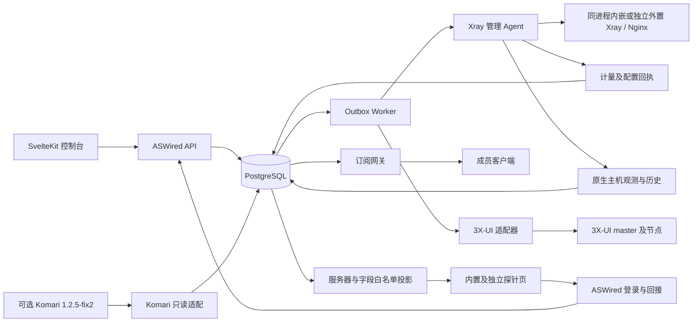

> 当前接入范围（2026-09-16）：服务器仅通过 ASWired Agent 接入，面板 API 适配已移出实施范围；本文相关旧设计只保留追溯。范围冲突时以 [当前实施范围](CURRENT-SCOPE.md) 为准。

> 当前实现说明（2026-09-16）：本文件保留设计目标与历史方案。已实现范围、测试证据和剩余差异以 [实现核对](reference/implementation-audit.json) 及三个仓库的 README 为准；未公开部分已获准采用 ASWired 原创等效实现，不承诺妙妙屋私有协议互通。

# 系统架构与部署

> 早期业务草案说明：本文仍保留旧版业务模型或原型交互供参考。自行提出的车主/多租户、AA账本、人工审批及付款流程不是本轮新增要求；角色、套餐和续费等实际行为以[第15份当前矩阵](15-完整功能与PRO对齐矩阵.md)及固定版本核对为准，不据旧稿另设流程。

> 当前决策（2026-09-15）：除PRO商业授权外，采用妙妙屋X的公开设计和固定版本行为，ASWired全部功能不设置付费墙。此前自拟的Agent多进程/mTLS、独立协调器、Vision拷贝替代、离线双策略及JWT刷新方案已撤回；当前节点、运行时、运维与登录规则以[13](13-子Agent详细设计.md)、[16](16-增强运行时与PRO执行设计.md)、[17](17-Agent运维测速与联邦设计.md)、[18](18-自有探针与登录回接设计.md)的0.3修订及[完整矩阵](15-完整功能与PRO对齐矩阵.md)为准。品牌、固定深色、三私有仓、JWT、自有探针和外部仅Komari1.2.5-fix2为用户既定要求。以下业务模型不是上游私有协议声明，尚未实现。


## 部署档位与技术选型

个人起步档：一台控制机运行反向代理、ASWired API/worker、PostgreSQL 与订阅网关，原生 Xray 管理模式的受管服务器部署 Xray 管理 Agent。Agent 以独立观测流提供自有主机探针；可选接入 Komari 1.2.5-fix2，第三方采集端由 Komari 管理。自有探针服务与登录回接由 ASWired 后端承担。先用数据库 Outbox，不强制 Redis。后端 Go，前端 SvelteKit/Svelte 5/TypeScript，Xray 管理采用节点Token/主控公钥与加密通道、WebSocket/HTTP/Pull，对象文件可以先存本地可备份卷。前端展示项目使用 adapter-node；正式部署可改为独立前端 Node 服务或 adapter-static + API 同源代理，不在未实现 SSR API 时伪称可直接 Go embed 当前构建。

扩大部署后再分离 API/worker/订阅网关，采用 PostgreSQL 主备、对象存储与至少两副本服务。公网只暴露入口反向代理；数据库与3X-UI管理地址在管理网络内。Agent连接及服务异常恢复按上游固定版本行为核对，不添加自定有限租约或离线双策略门槛。



## 1. 决策与部署结构

### 1.1 先用模块化单体，独立Agent与订阅网关

建议控制面使用Go、PostgreSQL及HTTP JSON API；异步worker与API可从同一代码库分别运行。前端只访问ASWired。首先采用PostgreSQL事务Outbox和任务表，不把Redis、消息总线或微服务作为正确性的前提；Redis后续仅用于缓存、限速和短暂会话加速。系统设计时就区分以下模块：

| 模块 | 职责 | 状态权威 |
| --- | --- | --- |
| 身份与权限 | 登录、MFA、组织成员、角色、对象级授权 | 用户及角色关系 |
| 资源管理 | 服务器库存、管理后端、核心能力、入站/出站、证书和配置 | 期望配置及版本 |
| 套餐与权益 | 套餐版本、购买、有效期、节点范围、设备策略、暂停 | 哪个席位现在应获得什么服务 |
| 拼车与订单 | 拼车组、席位、暂留、账期、AA、付款确认、退款流程 | 名额与订单事实 |
| 金额账本 | 收入/费用/退款/应收及分摊记录 | 不可变金额分录 |
| 配额账本 | 额度、消耗观测、调整与未知用量 | 流量预算与结算状态 |
| 交付worker | Outbox、版本交付、核对、重试、补偿 | 交付操作和节点回执 |
| 3X-UI适配器 | 版本探测、字段映射、完整写入、读回、错误归一 | 仅外部映射及观测结果 |
| 订阅网关 | 每席位独立token、格式渲染、缓存、撤销、下载记录 | 不自行改变权益 |
| 原生Agent | Xray 受限部署、运行时管理、配置回执、证书部署、本地配额执行 | 实际运行态、计量及原生主机观测来源；三种数据链路隔离 |
| Komari只读适配 | 固定 1.2.5-fix2、UUID 映射、指标归一、采样时间与新鲜度 | 仅 Komari 观测数据；不写配置或记账 |
| 公开探针投影 | 筛选获准服务器与字段，提供 ASWired 只读展示 | 不返回上游凭据或原始响应 |

推荐初期部署：控制面API×2、worker×2、PostgreSQL主备、对象存储、订阅网关×2，每台受管机器一个Agent。两API实例共享数据库；任务用数据库抢占，不能把进程内锁当全局互斥。订阅网关不依赖每次请求实时访问节点，使用已验证的权益快照和配置版本。

```text
浏览器 ──登录/资源权限──> ASWired API ──事务──> PostgreSQL
                            │                   ├─Outbox / 操作 / 审计
                            │                   ├─金额账本 / 配额账本
                            │                   └─权益 / 发布 / 席位
                            ├──订阅网关 ──读取生效快照──> 订阅客户端
                            └──Worker
                                ├─3X-UI适配器─> 受管master─> 它的节点
                                └─Agent安全通道─> 同进程内嵌Xray / 外置gRPC核心
                                                  └─遥测和发布回执
```

### 1.2 必须坚持的边界

1. 每台节点/运行实例只有一个**配置写入权威**；ASWired接管与3X-UI master同步不可并行写同一资源。
2. 登录用户、拼车席位、权益、代理凭证、订阅token是不同对象，不能共用一个UUID当所有主键。
3. 支付成功、权益授予、节点生效是三个状态；不能因为API返回200就显示“开通完成”。
4. 钱与流量是两套账本；流量清零、节点重启不产生退款或免费额度。
5. 控制面发“绝对目标状态+版本”，不发可以重复执行的“加30天/加100GB”业务命令。
6. 不向成员或团长浏览器下发3X-UI管理token、Agent私钥、节点证书私钥或其他席位凭据。
7. 将“最终一致配额”“具有明确上界的超额”“严格字节预算”作为不同产品能力，不用轮询冒充严格实时计费。
8. 自有探针与登录回接保留；仅外部探针接受 Komari 1.2.5-fix2。版本不符或未知时仅停止该 Komari 来源同步，不影响原生采集；双来源不静默切换，监控失联不修改配置、权益或账本。


## 6. 单一配置写入者与3X-UI过渡

### 6.1 原生节点的控制归属

每台服务器有独立Agent token，owner主控是唯一直接控制方；联邦consumer经owner转发加密操作，owner不读取consumer操作正文。授权/前缀、可选完整配置权限及端到端边界以第17份0.3设计为准。

同一运行实例不能由ASWired和3X-UI同时写入。导入、接管、配置变更、内外模式切换和恢复须记录实际结果；此前自定owner_epoch/node_sequence/本地签名授权状态机不再作为上游协议要求。公开资料不足的并发/重放细节列入固定版本核对。

### 6.2 3X-UI模式的真实限制

3X-UI API不能假定提供本地业务模型的并发控制契约。**不能仅给HTTP请求附加一个自定义epoch，就声称外部面板已具备强fencing。** 该模式通过限制写入口、每backend串行队列、独立面板凭证和操作后核对降低风险；在途未知请求必须等其结果或进入维护核对流程，再开展冲突操作。若外部操作者仍能同时改面板，必须显示“外部可写，可能漂移”的状态。

支持两种独立拓扑，不能混杂：

- **经master管理：** ASWired只写一个3X-UI master，master继续管理它的nodes；本地Agent仅做明确划分的系统维护和回执，不直接写Xray配置/客户，主机探针指标可由原生 Agent 独立观测流或指定 Komari 来源提供。由master提供的聚合流量只能记一次。
- **独立面板管理：** 解除旧master对目标节点的同步，ASWired为每个独立面板建连接和映射，通过适配器写其API。跨面板权益与流量由ASWired汇总。

每个profile记录版本、OpenAPI hash、已测试能力。v3.8.0适配必须处理：`email`查找、客户端完整替换、read侧数字`id`/`uuid`到write侧UUID`id`映射、`totalGB`为bytes、到期毫秒、`success:false`仍可部分成功、`nodePending`、cookie CSRF和token scope限制。调用后读回实际凭证，不能假设服务端不会生成或调整密钥。

部分成功不是通用回滚错误：更新前快照保存在operation_target；只对确认成功目标执行必要补偿。外部请求超时后先读回，若恰好等于desired则标已生效，不再盲创建；若旧值则重试；若第三种状态则标DRIFT/CONFLICT。3X-UI周期重置会尝试重新启用客户，因此适配器必须重算所有暂停原因，禁止清除业务停用。

参考官方实现：[API鉴权](https://github.com/MHSanaei/3x-ui/blob/837addf66e945a80080273b5d2a315dea765d748/internal/web/controller/api.go)、[客户端API](https://github.com/MHSanaei/3x-ui/blob/837addf66e945a80080273b5d2a315dea765d748/internal/web/controller/client.go)、[重置行为](https://github.com/MHSanaei/3x-ui/blob/837addf66e945a80080273b5d2a315dea765d748/internal/web/service/client_traffic.go)。


## 15. 观测性、故障处理与前端投影

核心指标：发布成功率/耗时、target待同步数、凭证撤销未确认数、sample延迟/缺口、计量未知窗口、额度动作结果、订单PAID_UNALLOCATED、付款去重冲突、账本不平、后台任务积压、订阅渲染失败、节点clock skew。

业务事件均携带request/operation/aggregate correlation id。告警按状态变化去重和恢复闭合；节点短暂断连不要每5秒重复通知。关键事件可发送Telegram/邮件，但发送失败不能撤销已成功的付款或权益事务；通知worker使用自己的Outbox消费记录。

前端读模型建议：

| 页面 | 应展示的独立状态 |
| --- | --- |
| 总览 | 活跃用户/席位、节点在线、服务可用、统计时间、收入/成本/待收各自口径 |
| 服务器 | 管理者、backend/core版本、最近心跳、desired/observed配置、drift、发布历史、证书到期 |
| 拼车组 | 已占/暂留/空位、账期、共享或独立池、已消费/保留/guard/可分配、AA应收与实收 |
| 订单 | 付款、名额、权益、交付四栏；“已支付待分配”有明确处理入口 |
| 成员订阅 | 本人独立链接、套餐scope、可用节点、截止、额度口径、设备登记与最近IP分别展示 |
| 操作中心 | 每目标结果、重试、待恢复、部分失败、是否可用、最近核对时间 |
| 账务 | 不可变明细、费用证据、分摊算法和余数分配、退款状态、调整记录 |
| 公开探针 | 原生/Komari来源、获准服务器和字段、实时历史、过期/未知、内置/独立部署及登录回接；原型保留演示标识 |

演示页面可以采用这些真实状态和字段，但所有示例值都应标注为演示数据；API未接入时不能把“实时连接”“付款已到账”“节点已部署”当事实。
