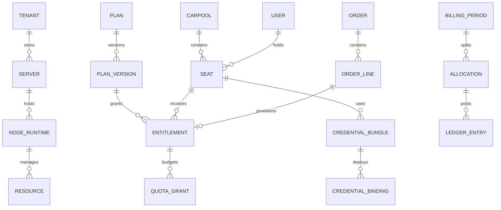

> 当前实现说明（2026-09-16）：本文件保留设计目标与历史方案。已实现范围、测试证据和剩余差异以 [实现核对](reference/implementation-audit.json) 及三个仓库的 README 为准；未公开部分已获准采用 ASWired 原创等效实现，不承诺妙妙屋私有协议互通。

# 数据模型与状态机

> 早期业务草案说明：本文仍保留旧版业务模型或原型交互供参考。自行提出的车主/多租户、AA账本、人工审批及付款流程不是本轮新增要求；角色、套餐和续费等实际行为以[第15份当前矩阵](15-完整功能与PRO对齐矩阵.md)及固定版本核对为准，不据旧稿另设流程。

## 3. 核心数据模型与约束

下表字段省略通用 `id`、`tenant_id`、`created_at`、`updated_at`。业务主键建议UUID/ULID；金额为 `BIGINT amount_minor`+ISO货币代码；流量为非负 `BIGINT` bytes；时间存UTC，日历账期另存IANA时区。JSON API把可能超过JavaScript安全整数范围的bytes/amount以十进制字符串传输，避免静默舍入。

JWT与登录存储模型按第18份0.3核对；不再将自拟session family/refresh链表作为必选。以下表为ASWired业务草案，涉及Agent身份/协议的字段以第13份0.3为准。

### 3.1 账户与资源

| 表 | 关键字段 | 约束/备注 |
| --- | --- | --- |
| tenants | name、status、default_currency、timezone | 跨币种不自动相加 |
| users | login_id、password_hash或identity_provider_id、mfa_state、status | login_id唯一；不用于代理email |
| tenant_memberships | user_id、role、status | UNIQUE(tenant_id,user_id) |
| servers | name、provider、region、address、cost_minor、currency、renewal_at、owner_tenant | 库存资源；可无Agent |
| node_runtimes | server_id、backend_kind、management_owner、panel_guid、agent_id、capability_hash、desired_revision、observed_revision、observed_hash、last_seen_at | 历史业务模型；当前同一Agent保持唯一直接主控，并发/重放行为按13与17核验契约 |
| backend_connections | backend_kind、base_url、base_path、credential_ref、tls_mode、ca_ref、cert_pin、version_profile | 只允许worker解密；不得在浏览器列表返回token |
| resources | node_id、kind、stable_key、desired_spec、desired_revision、enabled、deleted_at | 入站/出站/路由/证书绑定等；UNIQUE(node_id,kind,stable_key) |
| external_mappings | backend_id、resource_kind、rayno1_id、external_id、external_email、external_tag、panel_guid、last_observed_hash | 外部数字ID仅在panel域有效；不能按显示名称当主键 |
| config_templates | name、protocol、min_capabilities、latest_version_id | 模板名不决定兼容性 |
| template_versions | template_id、version、schema_version、content_hash、content_ref、created_by | 已发布版本不可变；UNIQUE(template_id,version) |
| certificates | domains、issuer、not_before、not_after、public_fingerprint、secret_ref、renewal_policy | 证书资产独立于面板路径；节点绑定另外存 |

`management_owner`是历史草案的内部分类，不是上游报文字段。原生归属在ASWired品牌下表示；当前关系与联邦范围以13、17、19为准，不由本表确定新协议枚举。

#### 原生与 Komari 探针模型

主机观测独立于 Xray `backend_connections` 与成员计量。原生采集使用已注册 Agent 身份；外部连接固定 `provider=komari`、`required_version=1.2.5-fix2`。双来源、主展示源、历史、公开站点和登录事务模型详见[自有探针与登录回接](18-自有探针与登录回接设计.md)。

| 表 | 关键字段 | 约束/备注 |
| --- | --- | --- |
| komari_connections | base_url、credential_ref、required_version、observed_version、verification_state、last_success_at、last_error_code | 凭据仅后端使用；版本未知或不匹配不得标为已接入 |
| komari_server_bindings | connection_id、komari_uuid、server_id、enabled | UNIQUE(connection_id,komari_uuid)；同一服务器可同时保留原生与Komari绑定；主展示源显式选择；不能按名称或 IP 猜测绑定 |
| komari_metric_snapshots | binding_id、sampled_at、received_at、metrics、availability、source_version | 缺失指标为未知；保留原始采样时间；主机网卡流量不进入成员配额账本 |
| public_probe_policy | site_id、enabled、server_allowlist、field_allowlist、source_selection_revision、version | 默认未公开；允许获准原生/Komari绑定，撤回同时使缓存/WS失效 |

`verification_state` 区分 `UNCONFIGURED`、`UNVERIFIED`、`READY`、`VERSION_MISMATCH`、`AUTH_ERROR`、`UNREACHABLE`；快照另记 `FRESH`、`STALE`、`UNKNOWN`，避免把上游连接失败当作所有服务器已离线。官方 fix2 的 `common:getNodes` 多节点结果是 UUID-keyed 字典，单 UUID 结果为单对象，归一后再按 UUID 映射。详细契约见 [Komari探针接入设计](12-Komari探针接入设计.md)。

### 3.2 套餐、权益、凭证、订阅

| 表 | 关键字段 | 约束/备注 |
| --- | --- | --- |
| plans | name、status、sale_scope | 产品目录 |
| plan_versions | plan_id、version、price_minor、currency、period_rule、quota_bytes、quota_mode、node_selector、protocol_policy、device_policy、expiry_policy、renew_policy | 售出后不可改；订单保存版本和完整快照 |
| entitlements | subject_type、subject_id、plan_version_id、start_at、end_at、status、desired_revision、policy_snapshot、source_order_line_id | 有效区间为[start,end)；同一订单行不能重复授予 |
| suspension_reasons | entitlement_id、reason_type、source_id、active、created_by、cleared_at | 手动/退款/过期/额度耗尽/安全分别保存；只清理自己原因 |
| credential_bundles | seat_id或personal_subject_id、scope、version、status、secret_ref、fingerprint、valid_from、revoked_at | 一席位一组独立凭证为底线；可以进一步按node/protocol独立 |
| credential_bindings | bundle_id、node_id、inbound_id、backend_client_id、credential_version、state | UNIQUE(bundle_id,node_id,inbound_id,credential_version)；active版本策略显式 |
| subscription_tokens | subject_id、token_hash、token_prefix、status、expires_at、rotation_parent_id、last_fetch_at | 32随机字节建议值；只存hash；一次返回明文；无法从token_hash重建token |
| subscription_snapshots | subject_id、entitlement_revision、credential_revision、format、body_hash、encrypted_body_ref、built_at、valid_until | 来自已核对配置；缓存键包含格式、策略版本和节点集合hash |

**凭证映射：** ASWired用户邮箱只用于登录/通知。适配3X-UI时，使用不含PII的稳定外部email标识，例如 `r1_<opaque_binding_id>`。同一client关联多入站时3X-UI复用其身份；若要求不同节点不同UUID，应创建不同backend client identity并在ASWired聚合，不强行塞进同一个外部client。各席位不共用凭证或subId。

**多套餐规则：** 同一个人可以拥有多个独立服务scope；节点访问范围按每个scope的有效权益计算。相同scope内基础流量包和加油包可以增加额度，但保留各grant独立到期日，按最早到期优先消耗。同scope多个接入套餐的设备限制默认取明确定义的计划优先级，不自行相加。不同scope的流量、席位与额度不互借，除非用户购买时明确选择可共享池。跨套餐续费不原地覆盖旧plan_version。

### 3.3 拼车、席位、订单

| 表 | 关键字段 | 约束/备注 |
| --- | --- | --- |
| carpool_groups | name、leader_id、status、capacity、quota_mode、currency、timezone、join_policy、node_scope、billing_policy_version | capacity变更必须有校验；历史账期不跟随新策略改写 |
| group_memberships | group_id、user_id、role、status | UNIQUE(group_id,user_id) |
| group_seat_slots | group_id、slot_no、occupancy_state、hold_id、active_seat_id、version | UNIQUE(group_id,slot_no)；每槽一次只能FREE/HELD/OCCUPIED之一 |
| seat_holds | group_id、slot_id、user_id、expires_at、state、checkout_id | ACTIVE暂留指向唯一slot；过期不是立即删记录 |
| seats | group_id、slot_id、member_id、status、joined_at、service_start_at、service_end_at、independent_subscription_subject_id | 在单slot上只允许一个未终止seat；凭证绑定seat而非slot号 |
| billing_periods | group_id、starts_at、ends_at、timezone、status、allocation_version、currency | UNIQUE(group_id,starts_at,ends_at)；相邻账期不得重叠 |
| orders | purchaser_id、status、currency、total_minor、hold_id、expires_at、pricing_snapshot、idempotency_key | 金额非负；每租户幂等键唯一 |
| order_lines | order_id、item_type、plan_version_id、seat_id、quantity、unit_minor、total_minor、policy_snapshot | quantity>0；sum(line totals)=order total |
| payment_attempts | order_id、provider、provider_payment_id、state、requested_minor、currency | UNIQUE(provider,provider_payment_id)；不存完整卡数据 |
| payment_events | provider、event_id、payload_hash、received_at、verified_at、applied_at、normalized_type | UNIQUE(provider,event_id)；同id不同hash为异常 |
| refunds | order_id、payment_id、amount_minor、reason、status、provider_refund_id、requested_by | 累计成功退款≤实际可退金额；退款失败不能记成功 |
| cost_items | period_id、category、supplier_ref、amount_minor、currency、evidence_ref、state | 服务器/流量/平台/调整等明确类别 |
| allocations | period_id、seat_id、rule_version、weight、amount_minor、remainder_rank、status | 已结算版本不可改；修正用新调整项 |

席位的“待支付”“待交付”“可用”不要塞入同一个含义混乱的字段。暂留、付款、权益、交付状态都可被单独查询，前端用组合摘要展示。

### 3.4 金额与配额账本

| 表 | 关键字段 | 约束/备注 |
| --- | --- | --- |
| ledger_accounts | owner_type、owner_id、purpose、currency | 每个账户单币种 |
| ledger_transactions | source_type、source_id、event_kind、occurred_at、reversal_of | UNIQUE(source_type,source_id,event_kind) |
| ledger_entries | transaction_id、account_id、debit_minor、credit_minor | 每笔交易同币种借贷和相等；分录不可修改/删除 |
| quota_pools | scope_id、period_id、status、grant_total_bytes、observed_used_bytes、version | 所有值≥0；按上游额度/统计口径核对，不推导自定硬字节租约 |
| quota_grants | pool_id、source_order_line_id、bytes、valid_from、valid_until、priority、state | 同来源不能重复发放；到期未消费额度冻结，不能回溯挪用 |
| quota_events | pool_id、grant_id、event_type、bytes、source_type、source_id、epoch_id、occurred_at | 追加记录；UNIQUE(source_type,source_id,event_type) |
| meter_epochs | node_id、runtime_instance_id、subject_binding_id、source、epoch_id、started_at、closed_at、close_reason、confidence | epoch唯一；每条epoch同时跟踪上传/下载；重启/重置/迁移分别结束旧epoch |
| meter_samples | meter_epoch_id、sequence、upload_cumulative_bytes、download_cumulative_bytes、sampled_at、payload_hash、received_at、quality | UNIQUE(epoch_id,sequence)；同epoch各方向累计值分别单调不减 |
| usage_postings | sample_id或结算batch_id、pool_id、grant_id、delta_bytes、quality、adjustment_of | 不重复记账；不能因样本回退自动记负消费 |

计量缺口单独标记，不能静默把未知当0。此前guard/lease/BOUNDED模型已撤回；计量epoch和samples仅为主控归一化数据，不规定上游Agent消息格式。

### 3.5 发布、任务与可靠消息

| 表 | 关键字段 | 约束/备注 |
| --- | --- | --- |
| operations | operation_id、kind、resource_id、desired_revision、state、request_hash、started_at、finished_at | UNIQUE(resource_id,kind,desired_revision) |
| operation_targets | operation_id、node_id、state、before_hash、desired_hash、observed_hash、attempt、last_error、last_seen_at | 每目标独立状态；保留部分成功 |
| deployments | revision、template_version、manifest_hash、policy_revision、rollout_policy、created_by | 版本不可变；回滚也生成新revision |
| agent_commands | server_id、operation_id、transport、upstream_request_ref、state | 主控操作关联模型；真实线上字段与去重行为按第13份0.3核对 |
| agent_receipts | command_id、phase、observed_hash、runtime_id、result_code、details、at | 回执追加；同phase允许幂等重传 |
| outbox | event_id、aggregate_id、aggregate_version、type、payload、published_at、attempt | 与业务事务一起提交 |
| inbox | consumer、event_id、payload_hash、processed_at | UNIQUE(consumer,event_id) |
| audit_events | actor、action、resource、before_hash、after_hash、operation_id、result、at | 追加、脱敏、可外部归档 |
| backups | backup_id、scope、manifest_ref、checksum、encrypted、state、created_at、restore_test_at | 必须记录可恢复性验证 |

初期业务行采用明确 `version BIGINT` 乐观锁；热点预算和最后席位采用数据库行锁。所有跨表写在一个事务中按一致顺序加锁，例如 tenant→group→slot→order→pool→grant，减少死锁。外部HTTP调用不持有数据库事务锁。


## 4. 状态机与组合状态

### 4.1 拼车组、席位、账期

```text
拼车组: DRAFT → OPEN → ACTIVE → CLOSING → CLOSED
                   ↘ PAUSED ↗
slot:  FREE → HELD → OCCUPIED → FREE
              └过期/取消→ FREE
hold:  ACTIVE → CONSUMED | EXPIRED | CANCELLED
seat:  RESERVED → ASSIGNED → PROVISIONING → ACTIVE → ENDING → ENDED
                                 ↘ SUSPENDED ↗
账期:  DRAFT → OPEN → CALCULATED → APPROVED → SETTLED → CLOSED
```

暂停原因另表保存；清除“欠费”不能清除“管理员安全停用”。seat ENDED后不能恢复复用同一个代理凭证；slot可重新出租但必须创建新seat及凭证。

### 4.2 订单、付款、权益、交付

```text
订单: CREATED → AWAITING_PAYMENT → PAID → FULFILLING → FULFILLED
           └→ CANCELLED/EXPIRED      └→ PAID_UNALLOCATED/REVIEW_REQUIRED
付款: INITIATED → PENDING → SUCCEEDED | FAILED | CANCELLED
退款: REQUESTED → APPROVED → SUBMITTED → SUCCEEDED | FAILED
权益: PENDING → ACTIVE → EXPIRED/REVOKED；SUSPENDED为有效区间内暂停
交付: QUEUED → APPLYING → VERIFYING → APPLIED
                 ├→ PARTIAL → RETRYING → VERIFYING
                 ├→ NODE_PENDING → RETRYING
                 └→ BLOCKED/CANCELLED
```

支付回调只确认付款事实；Outbox触发分配席位、授予权益和交付。支付在hold过期后到达且无空位，订单必须进入PAID_UNALLOCATED；不得抢占其他人的slot或凭空增加capacity。能按已授权策略分配其他可用slot时重新事务分配，否则待财务/用户解决或走退款。

续费生成新的订单行、权益区间和quota grant；只在生成绝对目标快照时合成新end_at。退款审批、退款平台成功、代理停止服务分别记录，不用一笔退款删除历史订单。


## 核心关系



## 数据迁移约定

所有 schema 变更有版本、向前迁移和恢复步骤。上线先 expand，再迁移数据，再切流，最后 contract；禁止同次发布删除旧字段并依赖新字段。外部 ID 必须包含来源命名空间。软删除保留审计引用；密钥销毁与普通资源删除分开。金额与字节均以十进制字符串经 JSON 传输，前端展示才格式化，避免 JavaScript 64 位精度损失。
