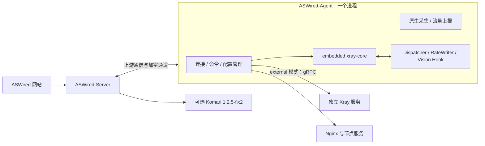

> 2026-09-20 最新范围：恢复 WebSocket、HTTP 直连、Pull（轮询）和 Auto（自动回退）；Xray 仍仅支持内嵌模式。具体连接行为与升级要求见 CURRENT-SCOPE.md。

> 当前实现说明（2026-09-16）：本文件保留设计目标与历史方案。已实现范围、测试证据和剩余差异以 [实现核对](reference/implementation-audit.json) 及三个仓库的 README 为准；未公开部分已获准采用 ASWired 原创等效实现，不承诺妙妙屋私有协议互通。

> 2026-09-18 实施范围更新：仅实现内嵌 Xray，外部核心及模式迁移实现已删除。新增服务器改为先配置、再复制主控提供的临时安装命令。本文下方外部模式内容仅保留为上游历史参考，不属于当前支持范围，详见 [CURRENT-SCOPE.md](CURRENT-SCOPE.md)。

# ASWired 子 Agent 详细设计

版本：**设计 0.3 / 2026-09-15；待确认、待实现，未做运行验证。**

本版执行用户的新决定：**除 ASWired 不设置 PRO 付费墙外，Agent 的架构和行为沿用妙妙屋X设计。** 保留已确定的 ASWired 品牌与图标、固定深色、三个独立私有仓库、JWT 用户登录、自有探针及登录回接；外部第三方探针仅接 Komari 1.2.5-fix2。功能范围见 [完整矩阵](15-完整功能与PRO对齐矩阵.md)，运行时细节见 [第16份设计](16-增强运行时与PRO执行设计.md)，运维见第17份设计，探针与登录见 [第18份设计](18-自有探针与登录回接设计.md)。

0.3 撤回 0.2 自行增加的特权代理拆分、独立增强核心进程、独立观测进程、跨进程策略协调、节点证书注册体系、另起的签名报文和离线策略分档。旧文件中与本版冲突的 Agent 条款不能继续作为实施依据。

## 1. 采用范围与证据边界

| 项目 | 本版采用 |
| --- | --- |
| 控制结构 | Master–Agent；网站访问 ASWired-Server，Server 管理 ASWired-Agent |
| embedded | xray-core 作为库直接运行在 Agent 同一进程，共享内存和生命周期 |
| external | 独立 Xray 服务，Agent 经 gRPC 管理；保留独立配置与升级路径 |
| 节点认证 | 每服务器独立长期 token，安装配置绑定主控地址与 master_public_key |
| 通信 | websocket / http / pull / auto；采用上游密钥协商、会话缓存和强制加密基线 |
| 运行能力 | 用户同步、配置与服务管理、限速、连接/IP、自动规则、计量、探针及完整运维 |
| PRO | 所有目标功能纳入同一 ASWired 产品，无许可证、商业档位或功能付费开关 |
| 未公开部分 | 对固定版本取得合法可用源码、接口契约或可重复样例后实现；未取得则保留阻塞 |

本次重新读取官方 Agent 部署、远程服务器、内嵌 Xray、节点限速、协议与探针文档。既有 [审计清单](reference/audit-manifest.json)记录稳定版 v0.5.4、预发布 v0.5.5-beta.6 及文档审查范围；这是取证基线，不是所有功能都已在稳定版验证。实现前逐项固定对应的 Server、Agent、核心版本与制品摘要，不能把不同版本的说明拼成一套已验证实现。

公开资料说明的是产品能力；文档示例和 mock 演示不是私有协议完整定义，也不是 ASWired 已经可用的证据。本轮不保证与妙妙屋现有二进制直接互连。

## 2. 进程与三仓职责

embedded 与 external 是同一服务器的两种运行选择，不是同时占用同一入站端口的两套核心。内嵌模式下，Agent 重启会影响核心；不会承诺网络管理进程退出而内嵌代理仍独立存活。外置模式有独立进程，但具体升级/停服流程是否主动停止 Xray，仍按固定版本验证。[官方模式说明](https://miaomiaowux.com/docs/embedded-xray/)

| 事项 | 归属 |
| --- | --- |
| JWT 登录、用户角色、登录回接、套餐和订阅业务 | 网站与 Server；Agent 不签发用户 JWT、不保管浏览器会话 |
| token、主控公钥配置、连接与命令分发 | Agent；Server 保存对应服务器和凭据关系 |
| 用户/配置同步、内嵌核心、外置 gRPC | Agent 同进程模块 |
| Xray/Nginx、证书部署、转发、节点运维 | Agent 按上游相应服务流程执行，详细边界见第17份设计 |
| 原生系统观测、网络质量和流量采集 | Agent 同进程模块；Server 存储并生成页面数据 |
| PRO 业务策略与界面操作 | Server 计算并推送；Agent 在相应运行模式执行 |
| 外部 Komari | Server 只读适配，不成为原生 Agent 的启动或工作依赖 |

Agent 的运行用户、目录和服务管理权限采用固定部署产物的要求核对，不再规定一套全进程非 root 的替代架构。模块可以分别测试，但不能把模块边界画成上游没有采用的常驻进程。普通业务授权、对象范围校验和秘密保护继续保留；它们不属于被取消的商业许可证校验。

## 3. 安装配置与节点身份

采用官方部署文档公开的配置语义。下表列的是已有字段，不是新的配对协议：

| 字段 | 用途 |
| --- | --- |
| `mode` | 远程 Agent 运行方式 |
| `master_url` | 所属主控地址 |
| `token` | 本服务器连接凭据；每台服务器独立配置 |
| `master_public_key` | 主控身份公钥，用于上游加密信道建立 |
| `connection_mode` | websocket / http / pull / auto |
| `xray_mode` | external / embedded |
| `listen_port` | Agent 直接管理接口监听端口 |
| `steal_mode` | 上游公开的相关部署选项，具体执行见运维设计 |

主控创建服务器、生成该服务器的安装信息，Agent安装后使用配置建立连接。节点凭据每服务器独立，不再改为一次性引导后换节点客户端证书。官网明确Server Token用于Agent连接主控、Agent Token用于主控调用Agent API；安装字段token的映射、轮换重叠与失联时更新行为必须以同一版本样例核对，不能在实现中猜测两类凭据完全相同。[Agent部署](https://miaomiaowux.com/docs/install-agent/)、[Token管理](https://miaomiaowux.com/docs/remote-servers/)

不得给两台节点复制同一凭据。页面需要保留独立生成、重置、在线同步和连接冲突排查能力；准确的冲突锁定、退避与恢复参数在固定版本测试后录入契约。节点 token 不替代用户 JWT，也不用于公开探针访问。

ASWired 的程序名与自有目录允许按品牌映射；配置键、用途、生命周期不能因改名而变化。映射清单放在三仓契约中，不复制真实 token、公钥私钥材料或他人安装环境。

## 4. 加密通信与待核对契约

采用主控身份公钥、密钥协商与会话缓存的上游设计。固定正式基线保留强制加密；缺失或错误的主控公钥必须产生可诊断的认证失败，不能为了连通而添加明文降级开关。官方部署说明明确 master_public_key 缺失会使强制加密认证失败；v0.5.4 发布说明记录了官方构建强制加密及身份密钥读取失败时的处理。[部署认证说明](https://miaomiaowux.com/docs/install-agent/)、[v0.5.4 发布说明](https://github.com/iluobei/miaomiaowuX/releases/tag/v0.5.4)

本版不预先自定密码套件、密钥导出字节、签名域、节点证书链或另一套会话授权协议。以下是必须补齐的互操作契约，不是已经采用的报文格式：

| 需要取得的材料 | 核对内容 | 出口 |
| --- | --- | --- |
| 加密握手样例或可用实现 | 双方身份绑定、主控公钥编码、协商步骤、密钥生命周期 | 同版本可重复握手和错误公钥失败样例 |
| 加密请求/响应样例 | 帧结构、完整性保护、nonce/计数器、失败响应 | 正反向字节向量；篡改不能执行 |
| 会话缓存与重连 | 过期、密钥更新、连接切换、重建时机 | 断线/重启/重置 token 的行为记录 |
| 反重放与请求身份 | 重复帧、重复操作、并发连接如何识别 | 实际响应和副作用次数可核对 |
| 轮换/失效 | Server/Agent Token 的双向同步、旧凭据何时拒绝 | 在线与离线节点分别验证 |

认证、安全检查和业务权限必须满足；缺少协议材料时标记待确认契约，不能发布“已兼容”或把自行设计的信封称为上游协议。ASWired 不伪造许可证、不请求或绕过上游授权；自己的实现不加入商业门槛。

## 5. 四种连接选项

| 选项 | 发起方与行为 |
| --- | --- |
| WebSocket | Agent 主动连接 Server，持续双向通信；按上游行为在连接期间隐藏本地管理监听 |
| HTTP | Server 直接调用 Agent 管理 API，Agent 端口需可达 |
| Pull | Agent 从 Server 定期拉取指令，适用于 NAT 等环境 |
| Auto | 按 WebSocket → HTTP → Pull 顺序回退 |

此处 HTTP 是上游连接方式名称，不代表可以关闭已经要求的加密信道。端口开启/关闭、回退判定、恢复到 WebSocket 的时机、心跳和轮询间隔采用固定版本实际行为；不沿用 0.2 自定的会话许可或时间常量。[官方连接说明](https://miaomiaowux.com/docs/remote-servers/#连接模式)

通信实现需覆盖以下业务往返，确切端点、消息类型和确认字段在取得材料后冻结：

- 连接建立、身份核对、心跳、服务器状态与版本。
- 服务扫描、配置读取/修改、服务控制、用户与限速策略同步。
- 原生系统样本、Xray 用量、在线连接/IP 和网络质量结果。
- 运维进度、错误、token 更新、模式切换及升级结果。

不再把原先自命名的 `/agent/v1/*` 路径、命令序号、独立观测签名信封作为已确认接口。三种实际传输必须通过同一固定版本的业务用例；切换期间重复请求、结果不明及补报行为列入验收，不能假定天然恰好执行一次。

## 6. 核心与配置生命周期

### 6.1 模式配置

external 维持独立 Xray、标准配置布局及 gRPC 管理。embedded 在 Agent 内创建核心实例，配置和核心的生命周期随 Agent。Docker 的官方部署路线为 host 网络与 embedded 镜像；不自行更换为多个核心 sidecar 或桥接端口代理方案。[部署模式](https://miaomiaowux.com/docs/install-agent/#xray-模式选择)

配置位置、服务名称和版本对应关系由第17份设计的部署映射明确。不能拿一个独立选定的官方 Xray 版本代表妙妙屋私有内嵌 fork 的所有能力。

### 6.2 配置编辑、历史和恢复

保留配置预览、修改、测试、历史快照、来源/hash、重新下发与默认配置修复。官网明确历史配置下发前进行验证，服务管理提供启动、停止、重启及配置应用入口。[服务管理](https://miaomiaowux.com/docs/xray-service/)、[配置历史](https://miaomiaowux.com/docs/remote-servers/#agent-菜单)

完整 config.json 保存按官网行为自动重启 Xray 生效；动态用户/限速更新另走对应路径。内嵌模式这一步是重建进程内核心还是重启整个 Agent、端口和原连接怎样处理、失败时保留哪个配置，必须记录固定版本结果。不能把“编辑保存成功”显示为运行成功，也不自建另一套两阶段发布协议后宣称沿用上游。

### 6.3 动态用户与 PRO

套餐绑定、变更、用户启停/删除、到期和额度变化，按上游业务触发用户及限制同步。运行模式、调用路径、保存位置和重启后的恢复来源见第16份设计。配置历史可以证明保存过版本，不能单独证明动态用户已经生效。

动态用户增删、会话踢出、重启恢复的内部 API 未完整公开；取得可验证材料是实施依赖。尤其删除凭据、禁用用户和关闭已有长连接应分别记录真实效果，不将其中一个成功推断为全部完成。

## 7. 原生探针与用户登录边界

自有探针由 Agent 内的原生采集模块提供，不依赖 Komari。保留 CPU、负载、内存、磁盘、系统身份/架构、uptime、网络速度/累计、预定延迟/丢包和回程等公开能力。Server 提供状态、实时推送和历史；公开字段按上游白名单与显示开关投影。官网列出约 5 秒公开推送和 1h/6h/24h 历史，缺项可省略，不能补成 0。[探针字段与历史](https://miaomiaowux.com/docs/probe-api/)

原生采样周期、容器内看到的是宿主还是容器资源、接口排除规则、历史桶聚合和错误处理，按固定版本验证。host 网络本身不等于全部宿主指标自动可见；不凭空补 root 挂载、容器管理 API 或专用观测服务。

样本、命令结果与用量属于不同业务事实，采集异常不能被解释为权益变更或用户用量清零。正常的采集错误/积压应可诊断；具体队列、缓存和缺样传输沿上游行为核对。由于采用同进程，Agent 进程崩溃会同时影响通信、采集与内嵌核心，本版不再承诺采集器进程隔离。

网站和自有探针用户认证使用 JWT，登录、回接和会话生命周期由网站/Server 负责。Agent 不保存浏览器 cookie、JWT、登录回调 code 或用户会话。Komari 1.2.5-fix2 仅为外部来源，不能替代原生探针；展示与回接细节以第18份设计为准。

## 8. 计量、持久化与故障恢复

### 8.1 已确认口径

内嵌文档描述 Xray 累计计数的非破坏性读取与 Agent 定期上报。用户计费用 Xray user/email 数据，主机网卡数据不能拆分成员；服务器卡片和用户套餐统计是不同口径。保留这些区别，不能用主机探针补成员账本。[内嵌流量统计](https://miaomiaowux.com/docs/embedded-xray/#流量统计)、[计量口径](https://miaomiaowux.com/docs/traffic-accounting/)

v0.5.4 公开记录了 WAL 观测、待重放移除及计数器回退等修复。这证明产品存在相关可靠性工作，**不能据此推定 Agent 使用某套离线 WAL、逐字节无损或确定的恢复状态机**。[发布记录](https://github.com/iluobei/miaomiaowuX/releases/tag/v0.5.4)

### 8.2 必须按版本取得的恢复行为

| 场景 | 必须记录的事实 |
| --- | --- |
| Agent 断开主控 | 核心是否继续、已装用户/限制是否保留、计量在何处缓存及缓存上限 |
| embedded Agent 重启 | 核心与计数重建、配置/用户/限制恢复来源、未上报数据处理 |
| external Agent 重启 | 独立核心是否受本次管理流程影响、已有计数如何续读 |
| 主控重启或备份恢复 | 重连、重新下发、重复操作和统计基线核对方式 |
| 动态修改后丢响应 | 查询/重试怎样判断已执行，是否持久记录结果 |
| 磁盘满/不可写、缓存损坏 | 实际错误、是否停止/继续、重试和缺失数据表示 |
| 时钟变化和长时间离线 | 到期/额度策略实际执行条件、重启后怎样恢复 |
| token/主控密钥变化 | 旧连接、缓存会话和失联 Agent 如何恢复认证 |

本版不新增可用性/强账务双策略、签名离线快照截止、在线启动挑战或自发预算。当材料未说明某一行时，标记“固定版本行为待确认”，不会自行选择继续服务或停止的替代规则。内存计数器尚未被读取的数据不能凭报表补出；完整备份一致回滚也不能仅凭普通软件状态宣称必被发现。

命令持久化、幂等、反重放、确认后裁剪和断电恢复仍是需要核实并满足的正确性要求；数据结构和线上确认格式待材料确定。没有源码/契约/样例的关键环节是实现阻塞，不是删减功能的许可。

## 9. Agent 仓内模块组织

以下是 ASWired 仓内代码组织，均为一个 Agent 程序的模块，不是新增线上协议或常驻进程：

| 模块 | 责任 |
| --- | --- |
| 配置与连接 | 上游配置语义、token/主控公钥、四种连接选项、加密会话 |
| 管理分发 | 服务/配置/用户/策略操作及真实结果 |
| 内嵌核心 | xray-core 初始化、Dispatcher、RateWriter、Vision Hook、在线统计 |
| 外置核心管理 | 外置服务状态、配置、gRPC、更新路径 |
| 统计与原生探针 | Xray 计数、主机采集、网络质量和上报 |
| 节点运维 | 上游的证书、Nginx、转发、测速与升级执行 |
| 持久状态与恢复 | 在固定材料明确后实现相应配置/缓存/日志/重放语义 |
| 协议样例与测试 | 固定版本请求/响应、配置、错误样例、客户端互通与故障回归 |

三仓独立构建和交付，协议与配置映射由 Server/Agent 共同锁定。完整业务、登录和模板逻辑不搬进 Agent。公开资料缺失的模块只能标待实现/阻塞，不用测试桩假装生产实现。

## 10. 阶段、契约缺口与验收

| 阶段 | 本文相关出口 |
| --- | --- |
| P0 契约 | 固定版本/资料清单、加密与业务报文样例、配置映射、已知冲突和缺失实现 |
| P1 运行时身份配置 | 一进程 embedded、独立 external、token/公钥、四种连接、配置/历史真实往返 |
| P2 用户管控计量 | 上游作用域的限制、自动规则、额度行为、用户同步、统计与故障恢复 |
| P3 运维证书 | 节点服务、安装更新、原生采集与网络质量 |
| P4 测速联邦 | 原有真实测速与共享行为，不以商业许可决定可用性 |
| P5 网站全业务 | JWT、自有探针/回接、管理与成员页面、完整业务和 PRO 操作联调 |
| P6 发布验收 | 所有必做项具备实现与证据，固定平台/协议/故障回归通过 |

验收必须包括：

1. embedded 核心与 Agent 同 PID；external 为独立 PID/gRPC，模式和升级影响与基线一致。
2. 独立 token、错误 token/主控公钥、强制加密、轮换及重复连接能得到可解释结果。
3. WebSocket 隐藏监听、HTTP 可达、Pull 获取任务和 Auto 回退真实生效。
4. 配置验证失败、动态修改、模式切换、响应丢失、进程重启均能核对真实状态。
5. 本文恢复矩阵每一行取得固定版本证据；不能用“有 WAL”代替无损证明。
6. 原生探针、用户计量和 JWT 登录范围一致；无 Komari 也能提供自有探针。
7. PRO 功能没有许可证调用、商业档位判断或未付费禁用分支；正常身份与资源权限保留。
8. 全范围没有被独立核心替代、慢路径降级或自设离线策略悄悄改变。

**本轮交付是采用上游设计的 0.3 文档。尚未创建代码仓、实现 Agent、部署节点或证明私有协议互通。公开缺口将作为明确工作依赖推进，不能把设计完成表述为功能完成。**
