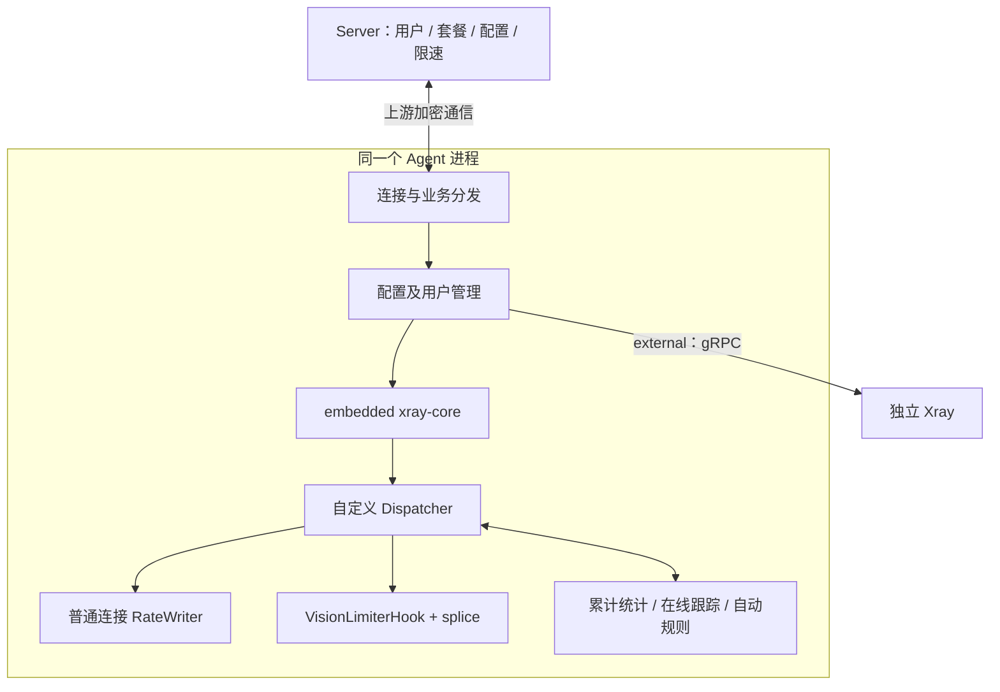

> 当前实现说明（2026-09-16）：本文件保留设计目标与历史方案。已实现范围、测试证据和剩余差异以 [实现核对](reference/implementation-audit.json) 及三个仓库的 README 为准；未公开部分已获准采用 ASWired 原创等效实现，不承诺妙妙屋私有协议互通。

# 增强运行时与 PRO 执行设计

版本：**设计 0.3 / 2026-09-15；待确认、待实现，未实测。**

本文件按用户决定沿用妙妙屋X的运行模式、核心集成和业务行为；**ASWired 不设置 PRO 付费墙**。原有 PRO 能力全部纳入完整交付，但运行模式和协议本身的能力条件仍需满足。总体身份、连接与恢复边界见 [子 Agent 详细设计](13-子Agent详细设计.md)。

0.2 的独立增强核心进程、跨进程配额服务、自选多核心适配方案、禁用 splice 的首版路线、独立授权预算及离线策略分档不再执行。公开材料不完整时保留验证依赖，不能以另一种架构替代后宣称与妙妙屋一致。

## 1. 两种运行模式

| 项目 | external | embedded |
| --- | --- | --- |
| 核心所在位置 | 独立 Xray 进程/服务 | Agent 进程内的 xray-core 库 |
| 控制调用 | Agent 经 gRPC | 进程内调用及上游核心扩展 |
| 生命周期 | 核心可独立管理，具体 Agent 运维动作影响另测 | Agent 与核心同进同退 |
| 核心更新 | 独立核心更新路径 | 随 Agent 构建与升级 |
| 高级限速/连接控制 | 上游文档明确不支持相应限速推送 | Dispatcher、RateWriter、Vision Hook 与在线跟踪 |
| ASWired 商业许可 | 无 | 无 |

移除付费墙不会让外置核心自动具备内嵌扩展。外置页面按上游模式限制功能入口，内嵌模式提供相应高级能力；不能保存一份未执行的限速配置后显示成功。[官方运行模式](https://miaomiaowux.com/docs/embedded-xray/)

### 1.1 Agent 内部调用关系

这是沿用上游的同进程结构，图中的模块不是单独的服务。Agent 崩溃会影响内嵌核心；不能继续承诺原有多进程方案的故障隔离、独立更新和低权限边界。需要验证 Agent 的系统权限、各模块错误处理及资源消耗，不能把改名后的二进制称为未经修改的上游发行物。

## 2. 核心构建与公开实现缺口

采用“上游模式、上游扩展位置、上游公开行为”的路线：

1. 固定对应版本的 Agent、Xray 库/外置核心、补丁和依赖，不再单独挑选一个官方 Xray 版本替代妙妙屋的全部协议基线。
2. 内嵌核心在 Agent 构建中集成，扩展 Dispatcher、统计、限速和协议的接入位置跟随可核对材料。
3. 对需要私有 fork 的能力，取得合法可用源码、准确补丁接口或足够实现的公开协议资料；尚缺材料就保持阻塞。
4. 同进程内可以按模块划分代码和测试，不另部署 sing-box、Hysteria、Mieru 等 sidecar 来改变本次采用的架构。
5. 公开核心或库是否可复用，须核对其来源和使用条件；不从文档样例推导已经取得私有实现，也不通过删除或伪造授权校验使用上游受限产物。

官网明确 Snell 是嵌入式 fork 的实现；AnyTLS 文档说明其通过 cherry-pick Xray PR #5907 集成。文档中的名称和配置例子不等于完整的可构建补丁。[Snell 实现说明](https://miaomiaowux.com/docs/protocol-snell/)、[AnyTLS 实现说明](https://miaomiaowux.com/docs/protocol-anytls/)

## 3. 配置与模式切换

embedded 启动按上游公开顺序：处理外置服务冲突、加载配置、准备 geodata、注入运行时组件和 Vision Hook、创建核心，再建立主控连接。模式切换涉及 Agent 重启；用户操作与配置位置按官网及固定部署样例实现。[启动与切换](https://miaomiaowux.com/docs/embedded-xray/#启动行为)

实施前记录以下可验证结果：

| 操作 | 必须核对 |
| --- | --- |
| external → embedded | 原服务停止时点、配置合并范围、端口归属、Agent 重启后的核心状态 |
| embedded → external | 外置二进制/服务准备、配置交接和实际启动结果 |
| 全量配置保存 | 按官网保存后重启 Xray 生效；核对测试入口、落盘顺序、内嵌核心重建/Agent 重启范围与失败返回 |
| 历史配置恢复 | 版本/hash/来源、下发前验证、恢复后的真实核心状态 |
| Agent 更新 | 内嵌核心同步更新范围、配置/用户/计数恢复；不能宣称不中断 |

完整配置保存后重启是官网明确的产品行为。[配置管理](https://miaomiaowux.com/docs/xray-service/) 本版不自设全量发布的两阶段报文或模式迁移许可。失败、超时和结果不明需要可核对；具体重试/恢复行为由固定上游版本的契约和样例决定。不能依据一张进程图推断切换无损。

## 4. 动态用户与策略同步

### 4.1 上游业务触发

保留用户绑定/更换套餐、用户启停和删除、套餐到期、额度变化、节点关联改变后的用户及策略同步。主控连接建立时需要同步相应限制。用户凭据、email 与独立套餐归属沿上游模型，不把主控用户 ID 直接当成所有协议共有的鉴权字段。[节点限速推送](https://miaomiaowux.com/docs/node-ratelimit/#自动推送时机)、[套餐管理](https://miaomiaowux.com/docs/packages/)

| 操作类别 | 本版要求 |
| --- | --- |
| 新增/变更用户 | 配置、鉴权与计量归属真实对应；具体动态接口按核心和版本核对 |
| 停用/删除/到期 | 实际撤除对应访问；不能只隐藏订阅或删除页面记录 |
| 限速/连接策略变化 | 按内嵌推送路径生效；外置模式不假装具备此能力 |
| 重连/重启恢复 | 以固定版本实际保存与同步机制重建，不能自造一份恢复快照协议 |
| 丢响应后重试 | 查询、重放和幂等行为需有证据；不把网络超时当作未执行 |

“限速热更新”不等于“全部用户/配置变化都是原子热事务”。完整配置仍按上游重启生效；动态用户的实际核心调用、修改怎样持久化及响应怎样确认，需拿到对应实现或报文样例后冻结。本版不采用 0.2 自命名的 Prepare/Commit 用户事务作为上游已确认接口。

### 4.2 生效时点的文档冲突

内嵌页描述无需重启的实时限速推送；节点限速页同时提示部分套餐修改要等待后续推送时机。保留实时推送能力，并按固定版本测试每个触发点的实际延迟及是否需要重连，不自行写入零延迟或固定秒数承诺。

测试至少覆盖：在线修改套餐、用户覆盖值变化、重新连接、Agent 重启、删除用户、旧连接仍活跃、请求重复及响应丢失。记录原连接和新连接各自结果，不能只检查主控数据库。

## 5. 限速、连接与在线 IP

### 5.1 限速参数与作用域

沿用已公开的下载限速、套餐默认与用户覆盖关系；保留 `inbound_tag`、`node_limit`、`users[].speed_limit`、`users[].device_limit` 等公开推送字段的语义，准确 schema 仍需版本样例。速率用 bytes/s 执行，页面 Mbps 按十进制换算；空值表示继承、0 表示明确不限的业务规则按对应表单实现。

官方内嵌页描述每入站每用户的速率桶；不要据此推断所有入口共享一个物理节点总速率桶。用户“全局覆盖”是配置覆盖层次，也不能直接解释为跨服务器总速率。0.2 自增的上传/合计桶、跨节点速率预算与统一全局调度不作为本版默认能力。[内嵌限速](https://miaomiaowux.com/docs/embedded-xray/#实时限速推送)

多套餐的独立凭据、额度与计量继续保留。不同套餐规则同时作用于同一用户时的准确速率合并和优先级，按固定版本实现及样例核对，不自选叠加算法。

### 5.2 并发连接数

`device_limit` 沿用上游字段名，但页面和文档明确它是并发连接数，不能称物理设备数。官方当前说明按“用户＋物理节点”共享，同节点子账号合用连接配额；到达上限只拒绝新连接，已有连接不受影响。[连接数规则](https://miaomiaowux.com/docs/node-ratelimit/#连接数限制)

不能把普通连接配额调整改成自动踢旧连接。TCP、UDP、协议复用/子流的具体计数单位、释放时点和异常退出回收，必须逐协议验证；未公开的细分不能用自建会话槽协议替代。

### 5.3 在线 IP 与踢连接

在线用户、连接数、来源 IP 和已列入完整矩阵的同时在线 IP 上限按相应版本交付。具体 IP 归一、NAT/迁移、范围、过期与计数生命周期须由上游样例核对。

以下三项不可混为一个成功结果：

- 连接数达限后拒绝新连接：上游已有明确行为。
- 禁用/到期后拒绝用户访问：按业务执行实际验证。
- 终止已建立会话：按版本、协议和实际操作证明，不由“删除用户成功”推断。

v0.5.4 有临近超额快速执行的发布说明，但这不是所有协议、所有禁用操作均能精确踢会话的统一证明。[发布记录](https://github.com/iluobei/miaomiaowuX/releases/tag/v0.5.4)

## 6. Vision 与普通流量控制

采用上游说明的两个执行路径：普通连接经 RateWriter；Vision 通过 VisionLimiterHook 在 splice 之前施加限速。未设置相应限速时按上游 Hook 行为保留原有 splice 优化，不再以关闭零拷贝、强制分块 copy 作为第一阶段替代实现。

Hook 与 Dispatcher 的实际函数签名、调用生命周期、并发安全和补丁版本必须取得材料。官网对路径的说明不证明某个未经修改的官方 Xray 库已包含该公共接口。[Vision Hook](https://miaomiaowux.com/docs/embedded-xray/#xtls-vision-限速)

| 测试路径 | 核对目标 |
| --- | --- |
| 普通 TCP | 用户归因、限速、统计、连接配额与结束回收 |
| Vision TLS/REALITY | splice 实际使用、Hook 生效、有限/无限状态切换、旧连接表现 |
| UDP、XUDP、协议复用 | 上游实际的关联单位、限速与统计覆盖，不凭普通 TCP 测试推断 |
| WS/gRPC/XHTTP | 不同传输与双向请求的归属、统计和策略行为 |
| Snell/AnyTLS | 走其嵌入核心的相同 Dispatcher 能力；协议特殊路径逐项验证 |

容量报告同时记录开启/关闭限速时的吞吐、CPU、内存和连接规模。保留优化路径是本版的选择，但性能仍需 ASWired 实测，不能直接沿用上游宣传数值。

## 7. 行为自动限速与额度动作

保留 `sustained` 和 `burst` 两类规则：持续超阈达到时间，或窗口内超阈次数达到条件后临时降速，按设置时长解除。全局默认、套餐覆盖、事件与通知按完整矩阵对应发布版本推进。

需要核对的内容包括：采样窗口、阈值单位、等号边界、重复触发、多个规则并存、套餐改动、到期解除与 Agent 重启后的规则恢复。采用上游已确认行为，不继续把自建惩罚状态机及独立 reason 表作为已经确定的实现。[自动规则](https://miaomiaowux.com/docs/embedded-xray/#自动限速规则)

套餐超额可停用或降速，额度重置/增加后恢复；与速度行为触发的临时降速分别验收。恢复后的实际速度、到期访问、其他套餐的影响及后续用量处理跟随上游套餐规则。不要把“降速后仍可用”表述成总字节硬封顶。[套餐执行](https://miaomiaowux.com/docs/packages/)

## 8. 完整协议目标与模式核对

官网矩阵作为创建向导、配置与客户端输出的目标清单。以下全部是待完成目标，不是 ASWired 当前支持清单。[协议矩阵](https://miaomiaowux.com/docs/protocol-matrix/)

| 协议 | 必须保留的组合 |
| --- | --- |
| VLESS | TCP+REALITY；TCP+REALITY+Vision；TCP+TLS；TCP+TLS+Vision；WS+TLS；gRPC+REALITY；XHTTP+REALITY |
| Trojan | TCP+TLS；TCP+REALITY；gRPC+REALITY |
| VMess | TCP/WS 分别配 None/TLS |
| Shadowsocks | AEAD aes-256-gcm；SS2022 2022-blake3-aes-256-gcm |
| Hysteria2 | UDP+TLS，已公开的相关选项按对应文档 |
| AnyTLS | TCP+TLS；TCP+REALITY 作为上游专家保留项，并保留客户端限制 |
| Snell | v4/v5 的独立 PSK/混淆；v6 的共享 PSK＋clientID/整形 |

协议矩阵内的 TCP 展示不等于所有协议都没有 UDP 代理能力，须结合单协议页核对。Mieru、SOCKS5、HTTP 等原功能矩阵中的条目继续保留，按上游实际的导入/输出、出站或原生服务能力分别验证，不能把“可转换订阅”直接升级为“本机入站已支持”。

### 8.1 必须关闭的公开资料冲突

| 项目 | 已公开事实 | 必须补齐 |
| --- | --- | --- |
| AnyTLS external | 安装页称两模式支持；协议页说明嵌入核心补丁路线 | 外置具体核心、版本、构建来源与可运行配置；不能声称普通官方 Xray 任意版原生支持 |
| AnyTLS REALITY | 上游保留后端组合，同时注明主要客户端不支持 | 专家页/订阅输出行为与实际可用客户端边界；不能伪造一般客户端互通 |
| Snell | 上游嵌入 fork 提供 v4/v5/v6 与统一用户能力 | 可合法使用的实现材料、版本字段、TCP/UDP、混淆/整形和逐用户控制 |
| 多套餐限制 | 套餐有独立凭据/额度；连接页规定共享用户＋物理节点名额 | 同一用户多套餐在速率/连接/IP上的准确组合，不推断统一算法 |
| 模式与新协议 | 安装/服务/协议页描述粒度不同 | 每个固定核心及模式逐项证据，不能只按协议名称打勾 |

安装与协议页的冲突在 [Agent 部署](https://miaomiaowux.com/docs/install-agent/)、[AnyTLS](https://miaomiaowux.com/docs/protocol-anytls/) 中可直接核对。本版不通过另选 sidecar 绕过这些实现依赖。没有公开实现的困难条目仍阻挡完整交付，不能改成“以后可选”。

## 9. 流量与离线恢复

保留上游的累计非清零读取、用户/email 归因和主控业务计算。服务器网卡、Xray 节点原始量、用户套餐加权量不能混用；倍率和历史边界按上游计量口径实现。[流量口径](https://miaomiaowux.com/docs/traffic-accounting/)

同进程 embedded 的 Agent 崩溃也会结束内嵌核心。external 的计数属于独立核心，其管理流程和重启次序单独核对。已读取、已上报、已落库及未确认的数据如何衔接，必须有样例；不能因使用累计计数就承诺全部增量无损。

离线继续运行、离线重启、用户截止、磁盘不可写、旧备份恢复的决定，统一采用 [第13份设计](13-子Agent详细设计.md) 的固定版本核对清单。本版没有额外的离线 profile、预算 lease 或启动挑战。尚未公开的状态机保持待确认，不自行选择“继续”或“停止”作替代行为。

可靠性验收需要覆盖计数器回退、重复上报、动态删用户、重启、配置切换和磁盘故障，并如实标示未知量。发布说明中的 WAL/重放记录不等于 Agent 离线日志和无损保证，也不能用来证明纯软件能检测全部一致备份回滚。

## 10. 取消商业门槛的实施边界

| 保留 | 不进入 ASWired 实现 |
| --- | --- |
| 内嵌运行模式及其真实技术条件 | PRO 许可证校验、商业有效期/档位检查 |
| 限速、连接/IP、自动规则、测速与分享 | 以 limiter 等商业特性授权位决定是否忽略操作 |
| 用户/管理员角色、资源范围与有效套餐业务 | 商业服务器/用户槽位、未购买禁用或升级购买提示 |
| 加密通道中的身份与完整性检查 | 向上游许可服务伪造票据、模拟授权成功或绕过其受限发行物 |
| 能力和实际版本检查 | 把未实现功能显示成“已授权即可用” |

ASWired 自行构建所需功能；上游 PRO 仅作为来源文档的功能分类。没有许可证服务器也应能使用已经实现的完整能力，但“免商业许可”不等于已取得私有源码或已完成协议实现。依赖缺口必须先解决，不能用假许可响应掩盖。

## 11. 实施与验收出口

| 阶段 | 运行时相关交付 |
| --- | --- |
| P0 契约 | 固定上游版本、构建材料、加密/用户/限速报文、模式和协议冲突样例 |
| P1 运行时身份配置 | Agent 同进程内嵌、external gRPC、配置与模式切换真实运行 |
| P2 用户管控计量 | 动态用户、上游作用域限速/连接/IP、Vision Hook、自动规则、额度与计量 |
| P3 运维证书 | Agent 更新连带内嵌核心、配置恢复、证书/站点和原生采集 |
| P4 测速联邦 | 沿用上游执行与共享设计，取消商业门槛 |
| P5 网站全业务 | 模式/功能条件、JWT/探针/回接及全部用户业务真实联调 |
| P6 发布验收 | 每项固定版本与路径通过；未解决实现依赖归零后才能完整交付 |

必测用例：

1. 同 PID/生命周期与两模式服务行为；禁止把独立进程演示冒充 embedded。
2. 限速推送的实际生效时点、继承/0 值、多套餐与多入站作用域。
3. 连接名额按上游作用域共享；超限拒新，已有连接保持。
4. 禁用、到期、超额和踢会话分别在长 TCP、UDP及复用连接验证。
5. Vision 确实保留 splice 并经 Hook 控速；没有以慢路径替换后声称同实现。
6. sustained/burst、额度降速与恢复按固定规则生效。
7. 目标协议每组合核对配置、客户端互通、用户归因及高级控制；不只测握手。
8. 重复请求、响应丢失、断线、Agent/核心重启、磁盘故障按已取得恢复契约回归。
9. 所有功能无商业授权条件；正常身份、加密与对象权限仍有效。
10. 原生探针与成员计量不同口径，采集模块在 Agent 内；JWT 与登录回接留在 Server/网站。

**尚未实现或实测。** 本版确定沿用的上游架构与功能行为；内部契约缺失继续阻挡相应实现，不能用新的原创替代路线结束这些工作包。
