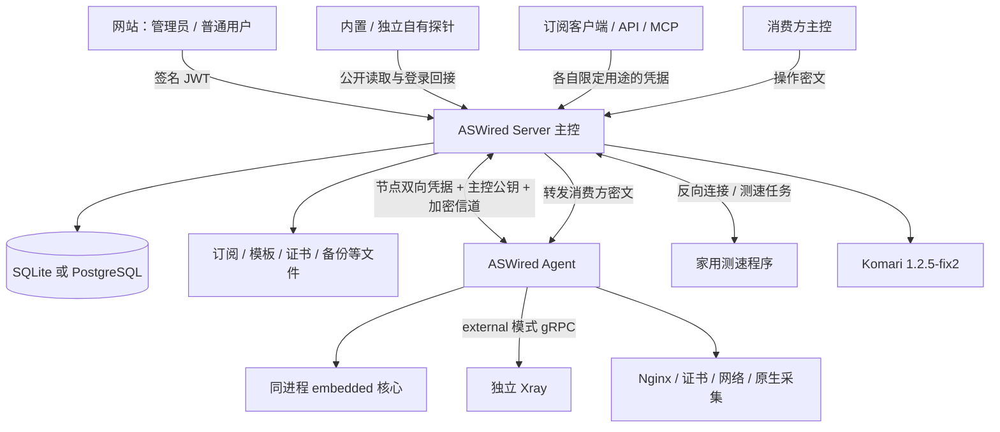

> 当前接入范围（2026-09-16）：服务器仅通过 ASWired Agent 接入，面板 API 适配已移出实施范围；本文相关旧设计只保留追溯。范围冲突时以 [当前实施范围](CURRENT-SCOPE.md) 为准。

> 当前实现说明（2026-09-16）：本文件保留设计目标与历史方案。已实现范围、测试证据和剩余差异以 [实现核对](reference/implementation-audit.json) 及三个仓库的 README 为准；未公开部分已获准采用 ASWired 原创等效实现，不承诺妙妙屋私有协议互通。

# ASWired 主控后端详细设计

状态：**主控设计 v0.1，按妙妙屋公开设计核对，供评审；配套 Agent v0.3，尚未实现。** 日期：2026-09-15。

本设计承担网站与 Agent 之间的完整业务闭环。范围依据[完整对齐矩阵](15-完整功能与PRO对齐矩阵.md)：妙妙屋 X 稳定 v0.5.4 与预发布 v0.5.5-beta.6，公开仓参考 commit `f16a72407366c888e4c9685afc784e7f666e268f`。146 个原始功能记录，加 22 个细化验收项，共 **168 个追踪项**，不是 168 个互不重复的上游独立功能。

逐项主控职责、Agent 配合、网站结果与验收出口见[主控全功能验收清单](20-主控全功能验收清单.md)及[机器可读清单](reference/aswired-server-coverage.json)。本文件给出整体设计和跨模块流程；第20份负责证明范围没有遗漏。

## 1. 已确定的产品边界

- 三仓：`ASWired` 网站、`ASWired-Server` 主控、`ASWired-Agent` 节点及家用测速端，各自构建与发布，继续保持私有。
- 原普通与 PRO 功能均纳入统一发行，不要求购买、激活、许可证服务或商业额度。节点身份、用户权限和加密校验继续执行。
- ASWired 品牌、固定深色、无主题切换；自定义 CSS 保留。界面沿用当前确认的设计，包括弹窗不显示右上角关闭叉。
- 自有探针、内置/独立展示、密码与 Passkey 登录回接全部保留；**只有外部第三方探针供应方限制为 Komari 1.2.5-fix2**。
- 用户登录采用签名 JWT，不退化为随机会话 Token。节点、订阅、个人 API、联邦和探针读取凭据各有用途。
- 角色按管理员/普通用户及上游权限对齐。“车主”是业务称呼，联邦 owner 是主控的分享身份；均不新增第三种平台角色或多租户产品。
- 历史拼车市场在目标预发布已移除，保留历史映射而不恢复入口；套餐分配、续期、拼车使用流程仍纳入。早期 AA、财务审批和多工作区草案不成为新增范围。

“全部功能”表示目标清单全部交付。公开资料没有给出完整私有协议或核心补丁的地方，继续保留功能目标与验证依赖，不能用一个不同的机制冒充已对齐。当前 UI 的本地演示成功也不代表后端已完成。

### 1.1 主控设计原则：最小化 Agent 服务器流量（2026-09-20 补充）

在保证必要心跳、准确计量、任务执行与安全控制的前提下，主控应尽可能减少 Agent 服务器的网络流量。新增或修改功能时必须明确数据来源、同步触发条件、传输上限与复用方式，避免页面刷新放大为节点网络请求。

- 日志、诊断详情、完整配置等非实时数据优先按需读取；Agent 日志仅通过手动按钮同步，打开页面、切换服务器/日志类型/行数和定时刷新均不触发拉取。
- 优先复用主控已有数据或当前有效快照，并显示其时间与来源；不得将旧快照表示为实时状态。日志文件仍是唯一历史来源，页面快照不成为独立日志存储。
- 读取限定范围、行数和字节数，不为查看最近记录传输完整日志。已有操作返回所需数据时直接复用，避免操作完成后重复请求；支持增量或条件读取时优先采用。
- 合并重复请求，限制并发；离开页面、切换对象或取消操作时停止等待并丢弃过期响应。断线采用有界重试和退避，避免高频重试耗流量。
- 必要的心跳、统计和配置同步分别设定周期与数据量，不因管理页面数量增加采集频率。新的高流量诊断、测速或自动同步功能必须有明确触发方式和流量范围。

本次落地范围为 Agent 日志手动同步、取消过期读取及复用清理返回快照；其他机制是后续实现和评审约束，不表示均已完成。

## 2. 证据与设计的层次

先还原妙妙屋实际公开设计，再确定ASWired如何对应；不能先定另一套架构，再用相近功能名称声称对齐。本轮直接阅读了官网业务/部署说明、固定README与Compose、版本发布说明；没有读取到上游完整私有后端源码，也没有运行上游服务完成黑盒验证。

### 2.1 妙妙屋实际设计与采用依据

| 核对对象 | 妙妙屋公开设计 | ASWired对应 |
| --- | --- | --- |
| [README技术栈](https://github.com/iluobei/miaomiaowuX/blob/f16a72407366c888e4c9685afc784e7f666e268f/README.md) | Go、net/http、SQLite/PostgreSQL，前端可嵌入二进制 | 第3节；不再沿用早稿强制PG/多worker架构 |
| [Agent部署](https://miaomiaowux.com/docs/install-agent/) | 同进程embedded、独立external、主控公钥与节点凭据 | 第7–8节及Agent v0.3 |
| [远程服务器](https://miaomiaowux.com/docs/remote-servers/) | 双向Token用途分开；WS/HTTP/Pull/Auto；实际扫描与历史 | 第6–8节 |
| [Xray服务](https://miaomiaowux.com/docs/xray-service/) | 完整配置保存后重启核心 | 全量配置和动态用户分开执行 |
| [用户管理](https://miaomiaowux.com/docs/users/) | 管理员/普通用户；JWT及MM-Authorization | 第6节；不增加车主平台角色或自定刷新链 |
| [套餐](https://miaomiaowux.com/docs/packages/)与[统计](https://miaomiaowux.com/docs/traffic-accounting/) | 多实例独立凭据/周期；节点与用户计量口径不同 | 第9–10节；不用早稿AA/权益租约替代 |
| [内嵌核心](https://miaomiaowux.com/docs/embedded-xray/)与[限速](https://miaomiaowux.com/docs/node-ratelimit/) | Dispatcher、RateWriter、Vision Hook及策略覆盖 | 第9节及第16份；保留技术结构，取消收费门槛 |
| [订阅生成](https://miaomiaowux.com/docs/generator/)与[规则覆写](https://miaomiaowux.com/docs/custom-rules/) | 既有格式、模板和覆写能力 | 第11节；精确管线顺序先核对样本 |
| [测速](https://miaomiaowux.com/docs/node-speedtest/) | 主控/家庭来源与实际代理测量 | 第13节及第17份 |
| [分享服务器](https://miaomiaowux.com/docs/share-server/) | consumer密文经owner转发、有限授权、吊销后保留入站 | 第14节；owner不明文编译正文 |
| [探针部署](https://miaomiaowux.com/docs/install-external-probe/) | 自有展示与公开读取/回接 | 第15节及第18份；仅第三方接入限制Komari |
| [备份](https://miaomiaowux.com/docs/backup-restore/)与[定时同步](https://miaomiaowux.com/docs/backup-auto-sync/) | 手动恢复、远程目的地、调度与恢复约束 | 第19节；两页PG矛盾单独验收 |

以上链接是核对入口，具体版本差异及每个功能的证据保持在第20份。官网页面中的mock演示只用于理解交互，不作为生产协议、默认时长或数据库结构证据。

### 2.2 公开事实与待核对细节

| 标记 | 意义 | 处理方式 |
| --- | --- | --- |
| 公开基线 | 官网、固定版本发布说明或公开文件明确说明 | 以对应版本行为作为目标；冲突登记并实测 |
| 职责与验收组织 | 为理解功能安排的模块、逻辑数据对象、结果证据 | 不代表已经采用新的数据库、任务机制或线上报文 |
| 待核对契约 | 握手字节、核心私有接口、恢复/冲突算法、客户端信任等未公开内容 | 取得合法材料或固定版本样本后冻结；未完成则相关验收不通过 |

下文的数据对象与“待验证”等状态用于解释职责和验收；尚未公开的内部实现不能仅凭这份表格定案。**不重新引入 mTLS 注册 PKI、独立 helper/runtime、预算 lease、owner_epoch 或 copy-only Vision 替代路线。** 完整配置重启、同进程 embedded、密文联邦等既定公开行为按第13–18份执行。

## 3. 部署与技术结构

### 3.1 正式交付

主控采用 **Go + net/http**，默认 SQLite，可选 PostgreSQL 18；一个主控应用提供 Web/API 与后台调度。原生安装、手动二进制和 Docker 均纳入。公开基线支持前端产物嵌入 Go 二进制。[上游技术栈](https://github.com/iluobei/miaomiaowuX/blob/f16a72407366c888e4c9685afc784e7f666e268f/README.md)

ASWired 网站当前是 SvelteKit/Svelte 5，上游是React/Vite；这是现有工程差异，不能声称同栈。现有原型能否保持上游交互与Go embed发行方式，必须单独核对；本轮不据此直接决定迁移框架或静态构建改造。三仓独立维护可与单二进制交付并存，具体产物接口和打包方式在发行契约中确认，现有Node原型构建不能直接冒充正式产物。

按官方单主控部署方式组织发行，定时工作由主控承担。不把Redis、NATS、额外worker或多副本选主作为安装前提。公开资料未说明多实例共享库、选主和并发写入协议，本版不预设其支持或实现机制。

### 3.2 运行拓扑

单主控应用不等于整机只有一个进程：Nginx、同机 Agent、external Xray 和可选 PostgreSQL 各有自己的生命周期。主控机器也可用作节点，但仍须添加服务器并安装 Agent，不能将本机任务绕过节点身份与状态管理。[同机接入流程](https://miaomiaowux.com/docs/tutorial/)

### 3.3 数据与进程部署

| 资源 | ASWired 设计 | 维护要求 |
| --- | --- | --- |
| 主控程序 | 原生服务或 Docker；发布记录包含网站/主控/契约版本 | 安装、升级、卸载与配置保留规则分别验证 |
| 业务数据库 | SQLite 默认；PostgreSQL 可选 | 双数据库迁移与恢复都纳入，不以 SQLite 测试代替 PG |
| 持久目录 | 数据、订阅文件、规则模板、证书及配置、日志 | 与程序版本解耦；容器重建后必须保留 |
| 密钥材料 | JWT 签名配置、主控身份、外部服务凭据 | 限制读写；备份时明确恢复依赖；禁止普通 API 返回秘密 |
| HTTPS/Nginx | 主控管理本机 Nginx，或对接已有反向代理 | 容器内进程操作不能调用宿主 systemctl |
| 任务与运行记录 | 按公开周期、日志和结果提供；存储方式待核对 | 不推定采用持久队列、Outbox或上游未公开任务表 |

Docker 按公开 host 网络部署方式设计；Nginx、数据挂载及 PostgreSQL 连接方式分别提供安装样例。ASWired 实际路径和环境变量在安装契约中冻结，不让品牌替换误伤上游备份/迁移识别。[原生部署](https://miaomiaowux.com/docs/install-direct/)、[Docker 部署](https://miaomiaowux.com/docs/install-docker/)

## 4. 主控内部模块

以下按一个主控应用的业务职责分组，便于评审覆盖；名称不是上游包名，也不提前规定私有内部调用和队列结构。

| 模块 | 主控职责 | 关键输出 |
| --- | --- | --- |
| identity | 初始化、管理员/用户、密码、TOTP、Passkey、JWT、个人 Token、登录回接 | 已验证身份、资源范围和安全设置 |
| packages | 套餐模板/实例、分配、续期、兑换、节点范围与限制继承 | 用户在各节点的有效凭据、配额和策略 |
| inventory / agentlink | 服务器、双向 Token、公钥、连接、扫描、地址、版本 | 真实节点状态和受管资源映射 |
| xray / policy | 全局/入站/出站/路由、Reality、模式、用户与限速计划 | 完整配置或明确的动态更新操作 |
| accounting | 原始用量、归属、倍率、周期、重置、超额动作 | 可复算用量、限制触发和统计视图 |
| nodes / subscriptions | 节点库、订阅源同步、格式转换、链接、模板与覆写 | 每个用户实际可用的订阅产物 |
| operations | 安装升级、服务、端口、证书、Nginx、DDNS、转发/隧道 | 每目标执行进度与实际验证结果 |
| speedtest | 主控/家用来源、队列、实际代理测速和历史 | 附实际来源、样本、出口和耗量的成绩 |
| federation | 分享、权限、命名空间与密文转发 | 有限管理委托和最终节点执行结果 |
| observation / komari | 原生观测、历史、外部适配、公开字段过滤 | 内置/独立探针的受控投影 |
| automation | 周期任务、通知、Telegram、MCP | 带调用身份的业务操作和运行记录 |
| maintenance / presentation | 数据库维护、备份迁移、日志、更新、外观配置 | 可恢复发行与页面配置 |

API、MCP、Telegram 和周期任务复用同一业务模块及权限判断。不能出现“网页禁止，但 MCP 可以绕过”或“一条入口只改数据库，另一条才通知 Agent”的两套行为。

## 5. 全功能覆盖地图

数目是146条原始记录与22条细化验收的合计；逐ID定义及证据见第20份。

| 功能域 | 追踪项 | 主控必须提供的业务能力 |
| --- | ---: | --- |
| 身份与权限 | 11 | 用户创建/生命周期、个人资料、TOTP/Passkey、API与订阅凭据、扫码客户端登录、菜单与额度权限 |
| 套餐与拼车 | 14 | 模板、多实例、分配/兑换/续期、独立周期配额、节点与客户端模板范围、合并订阅、拼车流程及历史移除项追踪 |
| 服务器与 Agent | 16 | 库存、安装接入、三种传输/Auto、双栈/DDNS/端口、凭据、运维、两核心模式、统计源、配置历史、节点同步与自建站 |
| Xray 配置 | 12 | 服务/全局配置、入站向导、全部基线协议与选项、Reality密钥、出站、WARP、路由预设与均衡 |
| 节点管理 | 15 | 导入/编辑/元信息/URI/临时订阅、自建同步、延迟、真代理测速、家庭来源与生命周期、外部探针映射 |
| 订阅源与转换 | 14 | 源管理、自动同步、匹配、外部流量、代理抓取、格式/兼容性、文件/链接/短链、信息与provider、变更推送和访问控制 |
| 模板与规则 | 13 | 模板版本/导入/编辑、选择器/地区/策略组、再生成、覆写、JS脚本、规则目录/托管/内置规则 |
| 中转与转发 | 10 | 路由出站、套餐/私有子节点、客户端分组、隧道、端口复用、原生链、成员转发、归属与WireGuard |
| 共享与联邦 | 7 | 分享接入、权限、Token、端到端加密、资源命名空间、吊销和既有资源管理 |
| 证书与网站 | 7 | DNS提供商、ACME/手工/Certimate、部署续期、Nginx站点及运行配置 |
| 监控与流量 | 11 | 管理员/成员统计、原生实时与历史、独立探针/API、网络质量、计量、流量明细、IP库、连接追踪 |
| 限速与接入控制 | 12 | 速率、连接、同时在线IP、自动规则、超额降速、Dispatcher/Vision执行、继承、共享限制与事件 |
| 通知与 Telegram | 7 | 事件/日报/公告、内置机器人、成员与管理命令、Mini App |
| 安全与外观 | 9 | 请求限制、Turnstile、静默模式、敏感数据加密、本地重置、固定深色/移动端、CSS及恢复 |
| 数据维护与集成 | 10 | 手动/远程备份、两种数据库及迁移、日志、调度、更新渠道、MCP、无商业许可的统一能力发行 |
| **合计** | **168** | **每项都需真实功能证据；付费解锁页不进入产品。** |

## 6. 身份、JWT 与权限

### 6.1 用户认证

密码登录、TOTP、Passkey 和探针页登录回接归 identity 模块。登录后签发 JWT；管理 API 按公开的 `MM-Authorization` 请求头验证用户，过期重新登录。JWT签名密钥首次初始化时由部署提供或安全生成并持久保存，不得缺省退化为随机Token。[用户认证](https://miaomiaowux.com/docs/en/users/#authentication)

HMAC签名与更换JWT_SECRET使全部会话失效是README公开说明；精确JWT算法、claims、前缀、有效期、浏览器存储、退出/停用时旧会话效果和跨域回接参数尚须固定版本核对。系统设置页面的mock默认值不作为生产协议依据。不预设5分钟、7/30天刷新链、强制BFF或新的OAuth授权码机制。[JWT环境配置](https://github.com/iluobei/miaomiaowuX/blob/f16a72407366c888e4c9685afc784e7f666e268f/README.md)

资源所属关系和功能权限由后端检查，前端隐藏菜单只是展示。普通用户仅访问自己的套餐、订阅、节点范围、历史和允许操作；管理员功能由后端拒绝越权请求。用户停用、改密和退出后旧JWT的有效性按固定版本验证，不在本设计中预定即时会话吊销机制。个人资料、凭据轮换、密码/TOTP/Passkey管理分别留有可核对结果。

### 6.2 凭据分工

| 凭据 | 使用者/用途 | 不具备的权限 |
| --- | --- | --- |
| 用户 JWT | 浏览器登录与用户 API；回接成功后同一身份规则 | 不能作为节点接入或分享 Token |
| 个人 API Token | API/MCP自动化，继承所属用户权限；MCP用Bearer请求头 | 不能提升到管理员 |
| 订阅凭据 | 订阅生成/下载、客户端入口；套餐独立代理凭据另存 | 不能登录控制台或操作服务器 |
| Server Token | Agent向主控认证、绑定具体服务器 | 不能冒用其他节点或用户 |
| Agent Token | 主控调用对应Agent管理接口 | 不能当作浏览器会话 |
| 主控身份密钥/公钥 | 节点加密通道及需要的技术身份 | 不代表商业授权状态 |
| 分享 Token | 消费方主控的有限管理委托 | 不能默认管理宿主服务、再分享或其他消费者资源 |
| 家用测速身份 | 接收允许的测速/抓取任务 | 不能安装核心或执行普通节点运维 |
| 探针只读密钥 | 独立页面/Worker读取批准的公开投影 | 不能签发用户JWT |
| Komari / DNS / 远端备份凭据 | 主控访问各外部服务 | 不下发为页面登录身份 |

官网明确区分 Server Token 与 Agent Token。安装参数中 `token` 的精确映射、是否允许同值、轮换期间旧凭据窗口仍需样例核对；主控逻辑模型从一开始保留双向用途。[节点凭据](https://miaomiaowux.com/docs/remote-servers/#token-管理)

### 6.3 登录回接与客户端信任

独立探针沿第18份提供密码/Passkey回接，验证来源与Related Origin Requests相关配置；不能借公开读取密钥建立用户会话。扫码客户端登录、订阅变化推送及发布说明涉及的客户端加密互信也属于范围。

上游客户端身份验证与许可证服务存在技术耦合。ASWired不连接商业许可证服务，但仍必须保留身份认证和加密完整性；P0须核对客户端信任根、证书签发/续签及替换发行方的合法可行性，不能先假定原客户端接受ASWired新身份发行方，也不能用删除验证来实现“免费”。[v0.5.4客户端与证书变更](https://github.com/iluobei/miaomiaowuX/releases/tag/v0.5.4)

## 7. 服务器接入与 Agent 操作闭环

### 7.1 接入

管理员建立服务器库存，设定地址/域名/IPv6、入口锁定、随机端口范围、核心模式、统计口径和探针展示字段。主控生成节点独立凭据、安装配置与Docker示例；Agent带主控地址、公钥和对应凭据建立加密连接。主控随后读取实际版本、模式、服务、配置与原生指标，核对服务器归属。

公开节点状态为 `pending / connected / disconnected`。三种传输为主动WS、主控直连HTTP、Agent Pull；Auto按WS→HTTP→Pull回退，WS期间隐藏Agent本地管理监听。传输切换不能改变业务权限或将旧结果当作新操作完成。[连接模式与状态](https://miaomiaowux.com/docs/remote-servers/)

### 7.2 操作完成的四层证据

1. **业务已保存**：主控数据库保存了请求的配置或设置。
2. **操作已送达/受理**：对应节点已收到或接受操作。
3. **节点已执行**：得到可核对的实际执行结果。
4. **服务已验证**：运行配置、版本、端口或代理连接符合目标。

内部操作记录保存发起者、目标、动作、请求配置摘要、发送/执行时间、结果摘要及验证证据。页面按实际已有证据展示“待下发、执行中、待验证、完成、失败或结果未明”，这些是ASWired内部呈现，不是宣称上游已有同名报文字段。

节点离线可保存允许延后的配置，但只能显示等待同步；不能返回“节点已应用”。执行成功而响应丢失时，先查询可观测状态，再按已核对契约决定重试。对开端口、续签、建立隧道等副作用操作，不做无条件重发。

### 7.3 核心协作表

| 操作 | 主控 | Agent/核心 | 完成证据 |
| --- | --- | --- | --- |
| 全量配置 | 编译/预览、历史、引用关系与下发 | 测试、保存、按基线重启Xray | 实际配置及新连接可用 |
| 动态用户 | 套餐与凭据归属、目标节点、启停/到期触发 | 对应核心用户接口及会话处理 | 实际凭据可用/拒绝效果 |
| 限速/连接/IP | 继承计算、目标策略和触发记录 | embedded实际数据通路执行 | 真实速度、连接与IP结果 |
| 模式切换 | 条件检查与影响展示 | embedded/external迁移、Agent重启 | PID、端口、版本和连接 |
| 用量 | 归属、倍率、周期、统计与超额动作 | 非重置读取累计、增量上报 | 已采集/上报/入账可对照 |
| 安装升级/卸载 | 目标版本、选择范围与进度 | 本机执行与重连/清理 | 实际版本、进程和资源结果 |
| 证书站点 | 资产、续期、域名、部署目标 | 写入正确引用、测试、重载 | 实际指纹与TLS/站点结果 |
| 探针 | 存储、历史、公开投影和权限 | 同Agent进程采集与上报 | 无Komari时也能独立工作 |

## 8. Xray 配置、Reality 与节点库存

主控统一管理全局设置、入站、出站、路由、规则预设和负载均衡。向导与完整JSON编辑都进入同一配置/引用检查，避免表单和全文相互覆盖。协议、传输、TLS/Reality、客户端选项按固定核心/客户端能力矩阵展示，不能仅凭协议名称判断兼容。

Reality编辑包含Target、SNI列表、私钥/公钥、Short ID、xver及对应高级字段。私钥列表默认不返回；授权编辑/显示密钥使用明确接口，公钥由私钥真实推导。完整配置变更和证书/密钥更换保存历史，日志不记录秘密正文。当前前端字段与WebCrypto校验只是交互原型，后端仍需独立验证。

两条执行路径分开：

- **完整配置**：取得当前实际基线→编辑/生成→验证引用及端口→生成历史→Agent执行配置测试→按公开行为重启Xray→读回运行状态。历史恢复走同一检查，不能只替换主控数据库。
- **动态变更**：用户、套餐和限制按第16份对应接口执行。不会把每次用户变化都当成全配置重启，也不承诺未核实的所有字段即时热生效。

节点库存保留外部订阅节点、自建入站节点、路由子节点及来源关联；扫描必须来自Agent实际服务。随机端口除了数据库分配，还需节点检查实际占用。地址/DDNS变更更新相关节点和订阅；手工改名、来源匹配和删除保留规则分别核对。[配置管理](https://miaomiaowux.com/docs/xray-service/)、[版本中的端口与同步修复](https://github.com/iluobei/miaomiaowuX/releases/tag/v0.5.4)

## 9. 套餐、用户与限速

### 9.1 套餐关系

套餐模板描述节点范围、流量额度、周期、过期、客户端模板和默认限制；分配后形成用户套餐实例。一个用户可拥有多个实例，每实例保持自己的凭据、起算基线、额度与有效期。未选节点表示全部节点并需界面确认；额度修改即时生效，倍率只影响后续增量。[套餐公开行为](https://miaomiaowux.com/docs/packages/)

v0.5.4明确同一用户不能重复绑定同一套餐，点击已绑定套餐进入已有实例编辑；独立实例并不意味着同模板可无限复制。模板、用户实例和实际代理用户不能合并成一张“用户剩余流量”记录。[实例绑定修复](https://github.com/iluobei/miaomiaowuX/releases/tag/v0.5.4)

创建/分配、兑换、续期、启用/停用、修改节点和合并订阅，均要计算受影响的实例、订阅及节点用户。用户可见续费状态与“已续费”等上游业务纳入；私有支付、审批或记账细则未公开时继续核对，不自行发明完整支付网关/AA系统。

管理套餐保留到期日、+30/+60/+90天操作、按月重置及流量覆写。快捷天数的基准、已过期续期和重置联动按样本核对；用户“我已续费”通知不能当作真实到账证明。[绑定套餐操作](https://miaomiaowux.com/docs/tutorial/#10-绑定套餐)

多实例总额度独立，并不表示现有单节点额度路径也已全面独立：公开统计说明单节点额度仍沿主套餐兼容路径，须保留并核对这一行为。[多套餐统计边界](https://miaomiaowux.com/docs/traffic-accounting/)

### 9.2 限制解析和执行

速率继承按 **用户每节点→用户全局→套餐每节点→套餐通用** 的公开优先顺序，空值表示继承，0表示不限。页面可解释最终值及来源；多实例同时作用于同一物理节点时的冲突取舍仍需固定样本，不自行采用求和/最小值算法。

速率、连接上限、同时在线IP和流量配额是四个独立约束。连接限制按用户＋物理节点共享；达到或降低上限后拒绝新连接，保留已有连接。到期/停用/额度动作的存量会话处理另行验证，不套用连接上限规则。[限速规则](https://miaomiaowux.com/docs/node-ratelimit/)

主控下发有效策略，embedded Agent在Dispatcher/RateWriter与VisionLimiterHook中实际执行，Vision保留splice目标。external模式不因取消收费而自动获得内嵌专有接口；界面应说明真实技术条件并提供模式迁移入口。[embedded运行结构](https://miaomiaowux.com/docs/embedded-xray/)

持续超速与窗口突发规则保存全局默认、套餐覆盖、触发/解除条件、处罚速度与期限；事件与通知开关分开。触发由第16份约定的数据通路执行，主控保存实际报告结果，不能仅凭自己的图表采样假定节点已限速。

### 9.3 到期与超额闭环

按公开的到期/超额处理核对订阅、实际节点访问或降速及通知；恢复额度或续期也要核对各项真实结果。订阅隐藏、拒绝新连接、关闭已有连接各自验收；近阈值轮询优化不能被写成全系统硬实时保证。

限速页“到期停用用户所有入站”与多套餐页“实例独立到期”的文字存在范围歧义。固定版本必须验证单实例到期是否影响同用户其他仍有效套餐；在此之前不能把一份套餐到期自行扩大为全账户断流。

## 10. 流量与历史数据

主控保留三条清楚的数据口径：服务器容量统计、Xray节点原始用量、用户套餐加权用量。主机观测速度和Komari外部数值是观测来源，不替代用户Xray归属。

### 10.1 入账路径

1. Agent非破坏性读取Xray累计计数，按已核对规则形成上报；原始上下行及所属服务器、入站、用户/email保持可追溯。
2. 主控核对计数与归属，识别重复、回退、重启或缺失样本；不把负差值当成退款，也不凭空填补未读取流量。
3. 按采集时对应的套餐/节点规则形成计费增量，保存适用周期及倍率依据。以后修改倍率只影响新的增量。
4. 更新实例用量、节点和服务器视图，触发额度动作；日报/曲线从相应事实生成。

用户公开计费公式为 `(原始上行 + 原始下行) × 套餐方向因子 × 节点倍率`，单向因子1、双向因子2；不能将“单向”擅自解释为只取下载。服务器可按U+D/U/D/max选择口径并使用自己的周期与校准值。节点原始量与用户加权量不要求数值相等。[统计口径](https://miaomiaowux.com/docs/traffic-accounting/)

### 10.2 聚合、切换与恢复

路由子节点要处理物理父节点扣除和用户归属，未知归属保留原因，不能在父子两处重复收费。管理员容量汇总、每日趋势、用户实例卡片和旧汇总字段分别定义查询，不共用一个“总流量”掩盖不同含义。

用户列表汇总所有计费凭据的用量，但列表限额仍来自主套餐；实例弹窗显示各自额度与用量。旧日账本不完整时可能回退快照估算，需要保留`complete=false`等真实标识，不能把估算当成完整原始记录。GB展示按1024³ byte核对。[用户视图](https://miaomiaowux.com/docs/users/)、[历史口径](https://miaomiaowux.com/docs/traffic-accounting/)

服务器统计源从Xray切到系统网卡有公开的历史连续性行为，反向利用持续保留的Xray快照；这与把Komari历史合并进自有采集是不同操作，实施时各自测试。[服务器来源切换](https://miaomiaowux.com/docs/remote-servers/#服务器流量统计维度)

计数器归零、Agent/主控重启、上报响应丢失、旧备份恢复及长时间离线均须回放真实样本。主控数据库事务可确保自己的入账操作一致，但跨节点不因此获得“恰好一次、零丢量”的保证。Agent缓存格式、确认与补报契约待13/16固定后实现，不提前编造序号或账本协议。

## 11. 节点、订阅、模板与规则

### 11.1 源同步

源配置保存URL、刷新策略、抓取来源/代理、匹配方式和外部流量信息。主控依次抓取→解析→匹配现有节点→呈现变更→按规则写入→重新生成受影响订阅。保留本地名称及覆盖项；区分更新已有节点和允许新增的同步策略。失败不得用空响应清空一个有效来源。

### 11.2 订阅生成

公开基础生成流程为验证订阅身份与可用节点→选择format转换器→应用相应模板→输出。DNS、规则、规则集覆写遵循启停、模板绑定及替换/追加/前置设置，JavaScript用于二次修改配置。JS与各客户端转换、模板及其他覆写之间的准确顺序仍须固定输出样本核对，不根据mock的“最后阶段”或“Lua”说明增加生产契约。订阅文件、短链、provider引用与重新生成关系按各入口实际行为保持，套餐改变要更新受影响产物。[覆写规则](https://miaomiaowux.com/docs/custom-rules/)

目标包括Clash/Meta、Surge、Loon、Quantumult X、Shadowrocket、Sing-box、Stash、Surfboard、V2Ray、Egern。公开入口包含 `/api/clash/subscribe?token=…&format=…` 和 `/x/<code>`；私有参数/格式细节按样本冻结，不用旧稿自创路径声称原协议兼容。[生成订阅](https://miaomiaowux.com/docs/generator/)

格式转换是协议与客户端版本矩阵：不能用“支持10种格式”暗示所有协议都能导出到所有客户端。按公开客户端兼容模式，开启时过滤不支持节点并记录日志，关闭时返回错误；不能静默丢字段后报告成功。具体格式/协议样本逐项核对。[兼容设置](https://miaomiaowux.com/docs/system-settings/)

### 11.3 模板与脚本

模板库、导入/编辑、版本、选择器、策略组、规则目录、托管与内置资源完整保留。模板/覆写变更能查到受影响订阅并重新生成。JS脚本执行设置资源与时间边界，敏感主控凭据不进入脚本上下文；确切脚本API与执行顺序按上游样本核对，不以另一套DSL代替。

## 12. 运维、证书、网站与转发

主控为每次运维保存目标、实际结果和失败点，批量操作可逐台完成/失败，不用单一成功提示覆盖混合结果。

| 业务 | 主控保存与编排 | Agent执行与验证 |
| --- | --- | --- |
| Agent/Xray/Nginx生命周期 | 版本、安装渠道、配置及选择对象 | 安装/升级/启停/重装/卸载，报告真实服务状态 |
| 证书 | DNS提供商、ACME/手工/Certimate资产、续期计划和部署目标 | 配对校验、正确文件引用、测试重载；核对实际指纹 |
| 网站与自建Reality站点 | 域名、证书、页面/反代、Tunnel/回落拓扑 | 实际Nginx与核心配置、443占用及访问验证 |
| DDNS与地址 | 域名、接口凭据、锁定入口、IPv6策略 | 上报实际地址；主控更新DNS及节点入口 |
| 路由出站/子节点 | 父子关系、套餐/用户归属、客户端组 | 生效路由、可达性、父子计量核对 |
| 转发/端口复用/原生链 | 拓扑、每跳资源、TCP/UDP、双栈与资源归属 | 实际监听、路由和端到端连接，失败后核对残留 |
| WireGuard/WARP | 配置、节点绑定、允许的注册/变更 | 第17份原生执行，不新增通用外置WARP sidecar |

证书“签发完成”和“部署到全部目标完成”分开；节点离线时显示待部署，旧续期任务不能覆盖更新证书。配置历史恢复必须检查证书和站点引用。共享父资源删除前核对其他用户/套餐引用，不能误删仍在使用的转发或入站。

升级完成以重连后的实际版本、配置和代理连通为依据。Docker拉取完成不等于升级完成，卸载造成断联不等于清理完成；不承诺未核对的自动回滚或零中断。具体平台、安装器和失败用例见[运维设计](17-Agent运维测速与联邦设计.md)。

## 13. 真实测速与家用端

测速模块管理来源、节点任务、权限、队列、取消/超时和历史。来源可为主控本机或Agent仓的独立家用测速程序；同一来源串行执行节点任务，不同来源可并行。固定mihomo版本承担实际代理测量，节点Agent承载被测节点，不能把Agent的网卡速度当测速成绩。

结果保留请求来源、实际来源、配置/核心版本、出口IP、原始延迟样本、下载字节/时间窗和失败原因。代理不可用时不能改直连并仍标节点成功；家用离线回落到主控要明确标注。家用身份只能执行允许的测速/抓取任务，配对、撤销及三平台更新见17。[测速公开设计](https://miaomiaowux.com/docs/node-speedtest/)

测速消耗与用户日常流量分开标识其来源，但具体是否和怎样计入节点/实例额度依固定版本规则核对，不自行默认免费耗量或重复收费。

## 14. 跨主控共享与联邦

owner主控管理服务器与分享授权，consumer主控管理自己的账户、套餐和配置意图。consumer操作正文加密后，经owner的HTTPS与节点加密链路转发给Agent；owner应用不能解密或明文重编译正文。Agent仍只接受owner这一个直接主控入口。

分享记录包含目标服务器、允许操作、consumer命名空间、凭据状态及显式完整Xray配置权限。默认仅能管理自己的入站等授权资源，不能管理宿主服务、任意再分享或修改别人的资源。全配置授权不得凭普通分享推定。[分享服务器](https://miaomiaowux.com/docs/share-server/)

主控保留允许的路由元信息和执行状态；consumer正文不进入owner请求日志、任务详情、错误正文或明文备份。吊销分享后阻止继续管理，但按公开行为保留既有入站；在途请求、既有流量和后续清理另验收。

端到端密钥认证、权限元信息与密文的绑定、防重放及多consumer并发处理是P0契约项。不能把owner不可读正文理解为能抵抗拥有节点宿主root的人篡改Agent；验收范围是合法部署下的应用与协议行为。

## 15. 自有探针、公开展示与 Komari

原生采集在同一Agent进程中完成，通过节点链路上报主控。主控保存实时样本、历史与来源/时间/容器范围，再按服务器与字段白名单形成公开投影；成员用量仍走第10节。

内置探针和独立探针共用展示契约。独立部署支持一个Worker承载静态资源、只读API和WS代理，读密钥放Worker Secret，主控使用HTTPS。公开路线包含：

- `GET /api/public/probe-servers`
- WebSocket `/api/public/probe-ws`
- `GET /api/public/probe-series`

独立接口保护使用`X-MMwx-Probe-Token`；历史`server`参数是公开服务器数组下标，不是数据库ID。实时更新按公开5秒目标，历史提供1h/6h/24h范围；采样与保存期限按实际版本/配置冻结，不凭时间选择器推定只存24小时。缺值省略而非填0，公开响应不包含服务器ID、IP、Token、Agent地址等管理信息。公开范围收回后，HTTP、WS订阅及缓存都须遵守。[探针接口](https://miaomiaowux.com/docs/probe-api/)

人民币续费价格换算在上游依赖许可证服务器汇率。ASWired保留换算展示目标并移除商业服务依赖，实际汇率来源、更新时间和失败展示另作契约核对，不能填造汇率或把换算功能一起删除。

Komari仅接 **1.2.5-fix2**，在主控存储连接配置、做版本识别与服务器映射。原生/Komari保留显式来源，缺值、离线、更新滞后有标识；外部故障不影响原生探针。Komari不执行用户鉴权、Xray控制或套餐计量。详细字段以[第12份](12-Komari探针接入设计.md)和[第18份](18-自有探针与登录回接设计.md)为准。

## 16. 通知、Telegram、MCP 与安全外观

### 16.1 事件与工具入口

主控把到期、流量阈值、自动限制触发/解除、任务失败和订阅变化送入通知模块，按账户、渠道与事件开关发送；日报和公告是独立功能。发送记录可查，不以关掉某一类限速通知来关闭其他到期提醒。

Telegram包含内置机器人、普通用户命令、管理命令和Mini App；绑定、验证、解绑与权限由主控决定，复用套餐/订阅等业务模块。确切命令与Mini App登录样本需逐项登记，不能用一个Webhook占位符宣布完成。

MCP采用 `/mcp` Streamable HTTP、个人API Token的Bearer认证。按v0.5.4发布说明核对109个工具，而不是沿用较旧页面的26个目录；109只是版本数量记录，交付必须逐动作映射。危险写操作按公开要求检查确认参数，普通Token不能越权。[MCP接口](https://miaomiaowux.com/docs/mcp/)、[v0.5.4工具扩展](https://github.com/iluobei/miaomiaowuX/releases/tag/v0.5.4)

### 16.2 安全与外观配置

请求限制、Turnstile、静默模式、敏感配置加密、本地管理员恢复、IP信息库及日志清理均属于主控正式功能。外部URL抓取、证书Webhook和代理测试按其业务目的校验目标及凭据，错误信息与日志不泄漏秘密。

外观配置覆盖品牌、移动端、登录/管理/成员/探针CSS和恢复入口；保持固定深色，不提供白天/系统模式。用户权限与CSS编辑权限由后端校验，写坏CSS时可通过已核对的本地恢复方式清除，不能因页面不可用而丢失订阅服务。[自定义CSS](https://miaomiaowux.com/docs/custom-css/)

## 17. 逻辑数据关系、任务与一致性要求

以下依据公开业务对象归纳关系，用于确定责任与数据核对范围；不是最终SQL、ORM或上游私有schema。真实字段及内部状态随P0材料收敛。

| 对象组 | 核心内容 | 必须保持的关系 |
| --- | --- | --- |
| 账户/认证 | 用户、状态、密码/TOTP/Passkey、各类用户凭据 | 登录名不冒充Xray email；Token用途独立 |
| 套餐 | 模板、实例、分配、兑换、周期和覆盖策略 | 实例关联用户、凭据、节点范围及计量基线 |
| 服务器/连接 | 库存、地址、双向节点凭据、主控身份引用、连接与能力 | 地址/名称可变，身份不能按名称合并 |
| 核心/节点资源 | 实际模式、入站/出站/路由、节点、父子与来源关系 | 全配置与结构化编辑指向同一实际资源 |
| 配置/策略历史 | 内容摘要、来源、时间、引用和实际结果 | 主控意图与Agent观测分开记录 |
| 用量事实 | 原始计数、归属、周期、适用倍率、校准及未知原因 | 可复算，源切换/重启不能静默清账 |
| 订阅资源 | 源、同步结果、模板/脚本/规则、文件/短链、访问记录 | 修改能定位受影响用户与产物 |
| 运维资产 | 证书、DNS、网站、隧道/转发、版本和部署结果 | 共享引用可追踪；秘密材料单独访问 |
| 联邦/测速 | 分享范围与密文元信息；测速来源、任务及样本 | consumer正文不成为owner业务记录 |
| 观测 | 来源绑定、样本、历史、公开白名单及展示设置 | 不与用户计量混表聚合成唯一总量 |
| 任务/通知/维护 | 调度、尝试、实际结果、投递、备份/迁移与审计 | 操作者/目标/失败与恢复证据可核对 |

### 17.1 变更的一致性核对

先核对一次业务变更涉及的账户、套餐、订阅与节点结果，明确失败时哪些部分已完成、哪些未完成及恢复入口。上游数据库事务边界、操作持久化、任务表和补发机制尚未公开；本版不先采用自定义Outbox或命令状态机并称之为妙妙屋设计。

完整配置、动态用户和联邦操作共享真实节点资源；验收要证明没有越权覆盖，且结果可核对。是否使用版本号、队列或其他冲突检测方式不能从功能说明推定，具体跨来源冲突行为在P0用实机样本确定。

### 17.2 调度器

订阅同步、用户周期/配额、证书续期、DDNS、历史清理、备份、日报、更新检查及公开孤儿/凭据修复工作均属核对范围。按各功能实际支持的设置展示周期、执行记录、成功/失败和恢复入口，不假定全部任务共用一个已知的持久化调度引擎。

定时备份公开说明了检查周期、启动后暂缓和以上次成功时间判断的行为；不能据此推导其他任务均能跨重启续做。各任务的重启、重复、结果丢失和批量部分失败分别取样验证，不将“发送过”当作完成，也不引入多worker必需架构。[定时备份调度](https://miaomiaowux.com/docs/backup-auto-sync/)

## 18. API 与三仓契约

主控仓维护下列契约制品：

| 契约 | 内容 | 使用仓 |
| --- | --- | --- |
| 用户API | 身份、业务对象、权限、错误、任务和公开投影 | 网站 |
| Agent通信 | 双向身份、加密、传输、业务请求/结果、观测与用量 | Agent |
| 核心能力 | Agent/核心版本、模式、协议、动态更新和限制条件 | 主控、Agent、网站 |
| 订阅/客户端 | 格式、模板/覆写、链接、扫码与加密互信 | 网站、客户端适配 |
| 联邦/家用端 | 分享权限、密文/结果、测速配对与允许动作 | 主控、Agent仓的家用程序 |
| 探针/Komari | 公开字段、WS、历史、回接、版本与绑定 | 网站、主控适配 |
| 维护 | 数据库/备份格式、安装变量、升级与兼容范围 | 三仓发行 |

本文只列已有公开路径；尚未公开的API不补造为妙妙屋接口。`docs/contracts/openapi.yaml`是早期业务草案，必须按本设计和固定样例修订后才能作为实际契约。网站不得继续依赖早稿的AA/多工作区字段作为新后端要求。

制品包含固定版本、摘要、来源与输入/输出/错误样例；消费仓锁定版本快照。mock和fakecontrol用于独立开发，但只能验证ASWired已定义的契约，不能证明与未公开上游协议互通。

## 19. 备份、数据库迁移与更新

手动导出/上传恢复、初始化恢复、SQLite↔PostgreSQL迁移、WebDAV/S3/Google Drive定时备份全部纳入。备份覆盖业务库与订阅/模板/证书等必需文件，并标明主控身份和加密凭据的恢复材料。普通ZIP与历史`.zip.enc`分开识别；历史加密包用原密码核对，不能强制新格式后声称兼容。[备份恢复](https://miaomiaowux.com/docs/backup-restore/)、[远程备份](https://miaomiaowux.com/docs/backup-auto-sync/)

恢复验收覆盖来源/版本/格式检查、数据库和文件恢复、完整性校验、重新登录与Agent重连、配置/凭据/统计基线核对。实际暂停范围、执行顺序及失败恢复算法按固定版本验证，不先写成自定的恢复协议。旧备份不含的新用量或节点操作应明确表示，不能用恢复成功掩盖数据时间差。

公开资料对PostgreSQL“包含数据库”的ZIP支持有冲突：恢复页指向dump+目录，定时备份页又有包含数据库选项。P0记录样本格式，P6对固定版本执行真实PG备份与恢复；在完成前不宣称一份ZIP已保证完整PG恢复。

稳定/预发布更新渠道、网页检查、安装器与版本展示按公开方式提供，相关技术完整性/Guard行为要逐项核对，不因移除收费而统统删除。主控停机先结束Agent连接再关闭数据库，升级前验证备份；降级与自动回滚能力没有证据时不承诺。[v0.5.4恢复与停机改进](https://github.com/iluobei/miaomiaowuX/releases/tag/v0.5.4)

## 20. 关键故障验收

| 场景 | 主控必须呈现/验证 | 配套依赖 |
| --- | --- | --- |
| 节点断连与回退 | 最后观测时间、实际传输、待执行事项；恢复后核对实际状态 | 13连接契约 |
| embedded崩溃 | 核心同退；配置/用户/限制与计数恢复来源 | 13/16运行恢复 |
| external Agent重启 | 外置核心实际是否继续、统计能否续读 | 固定版本运维样本 |
| 执行后丢响应 | 显示结果未明，查询验证后决定重试 | 操作身份/重试契约 |
| 配置测试/启动失败 | 失败原因、实际仍运行的配置和恢复入口 | 配置历史及核心行为 |
| 超额/停用/降上限 | 订阅、新连接、旧连接分别核对 | 各协议、TCP/UDP/复用 |
| 重复/回退/缺失用量 | 保留事实与原因，重复不重复收费 | Agent读数/补报样本 |
| 主控密钥/Token更换 | 在线及离线节点、旧会话各有恢复结果 | 双向Token/公钥轮换 |
| 旧备份恢复 | 用户登录、节点配置、统计、秘密材料与文件一致性 | 两数据库恢复演练 |
| 磁盘满/不可写 | 操作和采集实际继续/停止情况、缺失数据 | 主控/Agent分别测试 |
| 续证时节点离线 | 已签发与已部署分开，上线应用最新有效版本 | 证书目标验证 |
| 联邦重试/吊销 | 不越权、不重复建资源、原入站保留 | 密文授权绑定及在途行为 |
| 家用来源掉线 | 结果真实来源、回落原因、取消与耗量 | 测速生命周期 |
| 公开字段收回 | HTTP/WS/缓存都不再提供被收回字段 | 18公开投影 |

## 21. 实施顺序与完成定义

| 阶段 | 主控交付 | 必须与Agent/网站联调的出口 |
| --- | --- | --- |
| P0 契约与样本 | 168项归属、版本/来源、关键未知、数据库与安装样本 | 节点加密、核心接口、JWT/回接、客户端信任和联邦契约可检验 |
| P1 接入与配置 | Go主控、数据库、JWT、服务器/双向凭据、四连接选项、全配置与历史 | 一台真实embedded与一台external完成配置/服务闭环 |
| P2 用户套餐与计量 | 模板/实例/凭据、订阅基础、限速继承、周期/配额、真实统计 | 动态用户、Vision、连接/IP、自动规则和故障计量 |
| P3 运维与观测 | 证书/网站、版本/服务、地址/转发、原生实时和历史 | 真部署、真证书、端到端网络和原生探针 |
| P4 测速与联邦 | 来源队列、家用端管理、分享与权限/密文转发 | 真代理测速、两主控及多consumer隔离 |
| P5 全业务入口 | 全格式/模板/规则、TG/MCP、安全外观、独立探针/回接与Komari | 普通与原PRO全部操作有真实后端，无商业门槛 |
| P6 完整交付 | 两数据库、三平台测速、安装/更新/迁移/恢复与全清单验证 | 168项逐条证据；所有待核对项解决或明确仍未完成 |

每项完成记录至少包含：ASWired三仓版本、上游对照版本、环境、输入、权限、真实结果、失败/恢复用例及证据位置。不能用页面数、按钮存在、HTTP 200、mock或任务受理替代功能完成。

优先完成可核对的基础模块，同时推进私有契约取证；涉及未知接口的相关功能不能抢先标完成。若固定版本材料无法取得，应保留该项未完成并说明影响，不以新架构悄悄替代。

## 22. 本轮交付范围

本轮交付主控详细设计、168项主控协作验收附录及页面文档入口，同步修正已有文档中与Agent v0.3冲突的JWT/BFF/旧协议表述。**没有创建新仓库、实现主控服务、部署节点或改变仓库可见性。**

阅读顺序：[本文件](19-主控后端详细设计.md) → [全功能验收](20-主控全功能验收清单.md) → [Agent总体](13-子Agent详细设计.md) → [运行时](16-增强运行时与PRO执行设计.md) → [运维/测速/联邦](17-Agent运维测速与联邦设计.md) → [探针/回接](18-自有探针与登录回接设计.md)。
